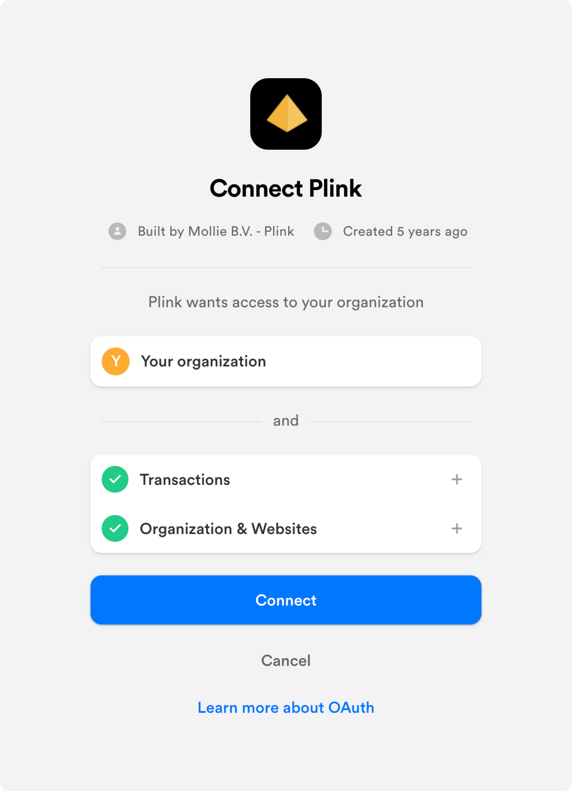

Getting started with Mollie Connect
===================================
With Mollie Connect you can connect multiple Mollie accounts together. See the :doc:`overview </connect/overview>` for
more information.

Most of the functionality of Mollie Connect leverages the open standard `OAuth <https://en.wikipedia.org/wiki/OAuth>`_.
This guide will explain how you can register your OAuth app, and how to connect your users to it.

Understanding the OAuth authorization flow
------------------------------------------
To support OAuth with your app, you will have to implement the common OAuth *authorization flow*. The flow starts with a
**Connect with Mollie** button, and, if all went well, at the end of it you will have received an access token. With
this token your app will be able to communicate with the Mollie API on behalf of the user.

The authorization flow looks roughly as follows.

.. image:: images/oauth-overview-flow@2x.png
   :class: boxed-in-dark-mode

Building an OAuth compatible app
--------------------------------
Next, you will have to build an app that supports the authorization flow detailed above. For many programming languages
there are open source packages available with detailed instructions to help you implement the flow.

Some examples:

* `Simple OAuth2 <https://www.npmjs.com/package/simple-oauth2>`_ for Node.js
* `The PHP League's OAuth 2.0 Client <https://github.com/thephpleague/oauth2-client>`_ for PHP
* `Authlib <https://github.com/lepture/authlib>`_ for Python, with support for common web frameworks like Flask and
  Django

If your application is built with PHP, you can integrate it using the official `mollie/oauth2-mollie-php <https://github.com/mollie/oauth2-mollie-php>`_ package. The `official Python client <https://github.com/mollie/mollie-api-python>`_ even supports OAuth out of the box.

Once you have an OAuth compatible app running, let's register your app at Mollie next.

Registering your app
--------------------
You can `register the app in your Dashboard <https://www.mollie.com/dashboard/developers/applications>`_. You will
receive a *Client ID* and *Client Secret*, both of which should be kept secret. These credentials can be used to:

* Redirect users to your app's authorization form (*Client ID*)
* Exchange auth codes for access tokens (*Client ID* & *Client Secret*)
* Renew your access tokens
* Deauthorize users from your app (*Client ID* & *Client Secret*)

Configuring your OAuth app
--------------------------
Use the details below to configure your app to work with our platform.

* **Client ID**: received upon app registration
* **Client Secret**: received upon app registration
* **Redirect URL**: a URL within your app that processes authorizations
* **Authorization URL**: ``https://my.mollie.com/oauth2/authorize``, see the
  :doc:`Authorize endpoint </reference/oauth2/authorize>`
* **Access token URL**: ``https://api.mollie.com/oauth2/tokens``, see the
  :doc:`Tokens endpoint </reference/oauth2/tokens>`
* **Resource owner URL**: ``https://api.mollie.com/v2/organizations/me``, see
  :doc:`Get organization </reference/v2/organizations-api/get-organization>`

Getting a merchant's consent
----------------------------
After having implemented OAuth and having registered your app at Mollie, you can send your user to Mollie through the
default authorization URL as configured in your app. Good practice is to show a *Connect with Mollie* button which
redirects the merchant to the authorization screen (i.e. :doc:`the Authorize endpoint </reference/oauth2/authorize>`).

When you send a merchant to the authorization screen, Mollie will tell the merchant what data your app has requested
access to, and request the merchant to confirm the authorization. An example authorization is shown below.

See :doc:`OAuth: Permissions </connect/permissions>` for a full list of available permissions you can
request from your user.

Working with access tokens
--------------------------
The merchant will be redirected back to your app, along with an *auth code*. With the auth code, you
can :doc:`retrieve </reference/oauth2/tokens>` an *access token* using default OAuth library functionality.

Note access tokens are time limited — you need to :doc:`refresh </reference/oauth2/tokens>` them periodically using the
*refresh token*. The time limits are listed below.

+-------------------------------+-----------------------------------+
| **Auth code**                 | 30 seconds                        |
+-------------------------------+-----------------------------------+
| **Access token**              | 1 hour                            |
+-------------------------------+-----------------------------------+
| **Refresh token**             | Does not expire automatically     |
+-------------------------------+-----------------------------------+

Once you have the access token, use the :doc:`/reference/v2/organizations-api/current-organization` to see which
organization authenticated to your app. This endpoint also allows you to retrieve the merchant's preferred locale. It is
recommended to switch your app's locale to the merchant's locale after the OAuth flow.

Using the access token on the Mollie API, your app may now access the merchant's account data, allowing the merchant to
start using your app.

.. _connect-button:

The Connect with Mollie button
------------------------------
To keep the user experience consistent, we recommend using one of the buttons below in your authorization flow.

.. image:: images/button-small@2x.png
   :align: left

`Download files <https://www.mollie.com/assets/images/branding/connect-button/connect-with-mollie.zip>`_

The download includes a Sketch file and retina PNGs.
