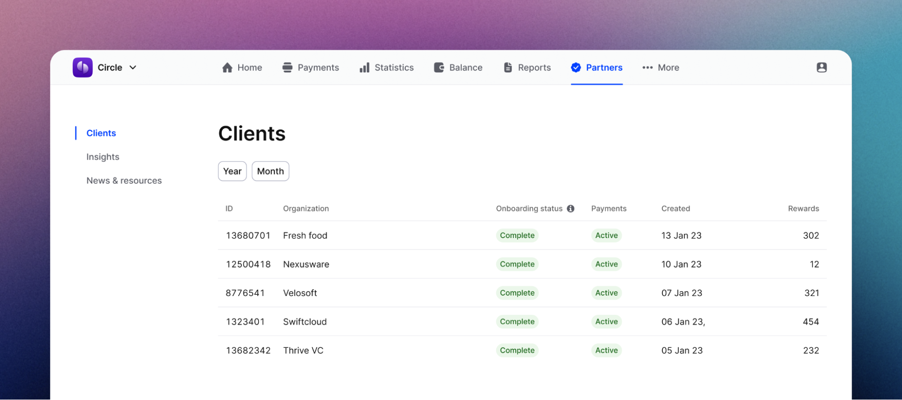
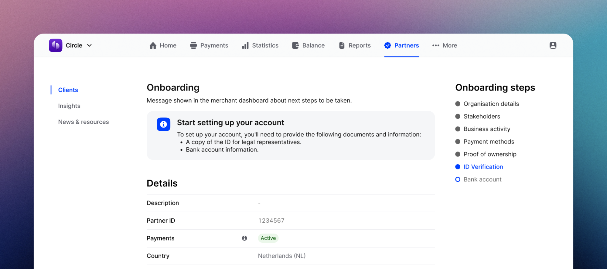

Managing your customers
================================

Mollie Connect assists you in monitoring and managing your customer's onboarding process through a set of dashboards, providing 
both an overview of all your customers, as well as a detailed per-client view.

.. note:: Your app needs to request 'organizations.read' and 'onboarding.read' permissions to access data of your customers in 
    the dashboards.

Partner or marketplace clients page  
-----------------------------------

This page offers an overview of all connected and onboarding merchants, searchable by organization name and ID. Check onboarding status 
(``needs-data``, ``in-review``, ``completed``) and the blocked payments indicator (available, pending, blocked) to identify accounts needing assistance.

Detailed clients page  
---------------------

Each connected client has a Client detail page where you can check organization details, a list of payment profiles (including statuses and enabled 
payment methods), and an overview of the merchant's onboarding steps. This provides full visibility for guiding your clients effectively.

Customer onboarding  
-------------------

Once your client has submitted all necessary data and enabled the required settings, Mollie initiates the review process. Ensure your clients are 
prepared for onboarding using the checklist below:

* Organization details provided
* Stakeholder information entered
* Website & products/services details provided
* Payment methods activated on the profile level
* IDs of legal representatives uploaded
* Bank account details added

More information on merchant onboarding can be found in the following articles:

* `How to create an account <https://help.mollie.com/hc/en-us/articles/210709969-How-do-I-create-an-account->`_
* `When does Mollie review an account <https://help.mollie.com/hc/en-us/articles/360017472719-When-will-Mollie-review-my-account->`_

