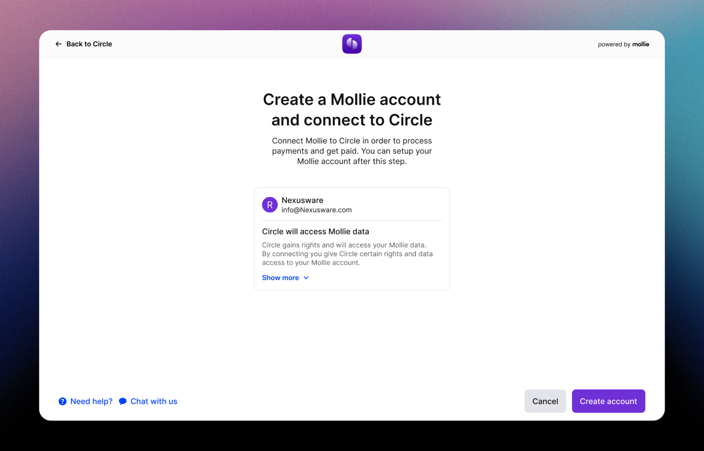

Onboard your customers
================================

If you have opted to use the Connect Onboarding toolkit as a Partner, this guide offers an overview of embedding your customer's 
onboarding process into your platform.

Step 1: Create an OAuth application
-----------------------------------

The Mollie Connect product suite relies on OAuth to manage one or more connected accounts. To start the implementation, 
create an OAuth app using the guidelines in the :doc:`Getting started guide for OAuth </connect/getting-started>`.

To ensure seamless interaction between onboarded customers and Mollie through your integration, carefully select the 
appropriate subset of OAuth permissions (referred to as scopes in OAuth terminology). Refer to the complete :doc:`Permissions list </connect/permissions>`, 
API references, and your platform's operations to determine the necessary permissions. 

In most cases, ``organizations.read`` and ``onboarding.read`` are recommended for monitoring account status. Note that adding permissions at a later stage will require the merchant to 
re-connect the app. For personalized advice, contact partners@mollie.com.

Step 2: Create an organization for your customer
------------------------------------------------

If your platform only needs to connect existing Mollie organizations, choose our standard :doc:`OAuth implementation </connect/getting-started>`.
For a seamless and automated Mollie onboarding experience, consider using the :doc:`Client Links API </reference/v2/client-links-api/overview>` built on Mollie's OAuth. 

Send customer details to the :doc:`Create Client Link endpoint </reference/v2/client-links-api/create-client-link>`, enriching it with OAuth app details. 
Pre-fillable data includes:

* Personal data of your customer

  * First Name
  * Family Name
  * Email address

* Organization name
* Address
* Registration number
* VAT number

The call returns the ``clientLink`` to redirect the customer to the authorization screen (as above). If it is a new customer, an organization will be created, the OAuth app 
authorized and your customer will be logged into their newly created Mollie Dashboard. 

For existing organizations, the OAuth authorize screen will be shown. In both scenarios, the customer returns to the ``redirect_url`` of your OAuth application, and the regular
:doc:`OAuth flow</connect/getting-started>` follows.

Step 3: Configuring your customer's profiles
--------------------------------------------

As your customer continues onboarding at Mollie, they will configure one or more website profiles. Profiles represent merchant storefronts, allowing for multiple trade names 
or markets within one account. Payment methods and transactions are always associated with specific profiles.

We recommend managing profiles on your customer's behalf through :doc:`Profiles API </reference/v2/profiles-api/overview>` to optimize the onboarding process:

* Send data to create a profile for your app using the :doc:`Create profile endpoint </reference/v2/profiles-api/create-profile>`.
* :doc:`Enable payment methods through the API </reference/v2/profiles-api/enable-method>`, noting that some methods may require additional API steps.

Step 4: Wait for your customer to complete Onboarding
---------------------------------------------------------

While waiting for your customer to complete their onboarding, use the :doc:`Onboarding status endpoint </reference/v2/onboarding-api/get-onboarding-status>` response 
to display the appropriate message.

Possible statuses are ``needs-data``, ``in-review``, and ``completed``. If ``needs-data`` is returned, Mollie requires more information and the API response contains a
``_links/dashboard`` deep link to the customer's onboarding wizard. We recommend including the link in your application with a clear call-to-action.

Two milestones, ``canReceivePayments`` and ``canReceiveSettlements``, indicate progress during onboarding. Display the following onboarding status messages:

+----------------+------------------+---------------------+------------------------------------------------------------+
| Status         | Payments enabled | Settlements enabled | Message you can show to your customer                      |
+================+==================+=====================+============================================================+
| ``needs-data`` | ``false``        | ``false``           | Before you can receive payments, Mollie needs more         |
|                |                  |                     | information. <Link to onboarding URL>                      |
+----------------+------------------+---------------------+------------------------------------------------------------+
| ``needs-data`` | ``true``         | ``false``           | You can start receiving payments. Before Mollie can pay    |
|                |                  |                     | out to your bank, you need to provide some additional      |
|                |                  |                     | information. <Link to onboarding URL>                      |
+----------------+------------------+---------------------+------------------------------------------------------------+
| ``in-review``  | ``false``        | ``false``           | Mollie has all the required information and is verifying   |
|                |                  |                     | your details.                                              |
+----------------+------------------+---------------------+------------------------------------------------------------+
| ``in-review``  | ``true``         | ``false``           | You can start receiving payments. Mollie is verifying your |
|                |                  |                     | details to enable settlements to your bank.                |
+----------------+------------------+---------------------+------------------------------------------------------------+
| ``completed``  | ``true``         | ``true``            | Setup is complete!                                         |
+----------------+------------------+---------------------+------------------------------------------------------------+

Once ``canReceivePayments`` flag is ``true``, you can start :doc:`creating payments </reference/v2/payments-api/create-payment>`.
