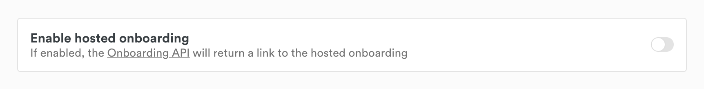

Onboard your customers at Mollie
================================

.. warning:: The hosted onboarding feature is currently in closed beta. Please reach out to our partner management team
             to enable this feature.

As part of the :doc:`Mollie Connect </connect/overview>` toolkit we offer white-label onboarding, along with a set of onboarding APIs and tools.
This allows you to provide a simplified Mollie onboarding experience for your customers, integrating the Mollie
onboarding deeper into your own onboarding flow.

This guide provides an overview of how to set up our white-label onboarding for your customers.

Step 1: Create an OAuth application
-----------------------------------

If you do not have an OAuth application or want to create a new one, have a look at the
:doc:`Getting started guide for OAuth </connect/getting-started>` before proceeding. You will need an OAuth app
with the authorization flow implemented for the next steps.

We recommend requesting at least the following permissions to onboard your customers during the authorization flow:

.. list-table::
   :widths: auto

   * - ``onboarding.read``
       Onboarding API
     - View the merchant's onboarding status.

       This permission is required if you want to monitor the onboarding progress of your customers in the
       `Mollie Dashboard <https://www.mollie.com/dashboard/partners/clients>`_.

   * - ``onboarding.write``
       Onboarding API
     - Submit onboarding data on behalf of the merchant.

   * - ``organizations.read``
       Organizations API
     - View the details of the merchant organization.

   * - ``organizations.write``
       Organizations API
     - Change the details of the merchant organization.

   * - ``profiles.write``
       Profiles API
     - Create a dedicated website profile for your app.

To ensure that your onboarded customers can create payments, it is essential that you request permissions for the Payments API and any related APIs.

Step 2: Enable hosted onboarding
--------------------------------

Once you have an OAuth app up and running, you can
`turn on hosted onboarding <https://www.mollie.com/dashboard/developers/applications>`_ in the Mollie Dashboard.

1. Find your application in the list and open it for editing
2. Turn on hosted onboarding in the app settings
3. Provide your application's logo and save the changes

.. note:: With hosted onboarding, the name of your application will be visible to your customers all the way through their onboarding journey.

Step 3: Create an organization for your customer
------------------------------------------------

With the OAuth authorization flow implemented and the right permissions configured, you can start creating organizations
for your customers using the :doc:`/reference/v2/client-links-api/create-client-link` endpoint.

The Create client link endpoint will return a special link where you will have to redirect your customer to.

If an organization already exists for your customer, your customer will be asked to grant the permissions you requested
for your application. Otherwise, the permissions will be granted to your application for the newly created organization
automatically.

Your customer will then return to the ``redirect_uri`` of your OAuth application and you will receive the `auth code`,
completing the OAuth authorization flow.

Step 4: Your customer starts onboarding
---------------------------------------

Now, your customer is ready to start onboarding at Mollie. To make the process even easier for them, you can send data
to create a profile for your app using the :doc:`/reference/v2/profiles-api/create-profile` endpoint.

Any data you submit up front in this fashion will be prefilled in the white-labeled onboarding flow. This is possible as
long as the onboarding status of the new account is set to ``needs-data``.

You can use the :doc:`/reference/v2/onboarding-api/get-onboarding-status` endpoint to get a link
to the white-labeled onboarding flow under the ``_links/dashboard`` property. We recommend that you redirect your
customer right away to this URL so they can provide the required onboarding information.

Example response
^^^^^^^^^^^^^^^^

.. code-block:: php
   :linenos:

    HTTP/1.1 200 OK
    Content-Type: application/json

    {
        "resource": "onboarding",
        "name": "Mollie B.V.",
        "signedUpAt": "2018-12-20T10:49:08+00:00",
        "status": "completed",
        "canReceivePayments": true,
        "canReceiveSettlements": true,
        "_links": {
            "self": {
                "href": "https://api.mollie.com/v2/onboarding/me",
                "type": "application/hal+json"
            },
            "dashboard": {
                "href": "https://www.mollie.com/dashboard/hosted-onboarding/app_j9Pakf56Ajta6Y65AkdTtAv/org_12345/onboarding",
                "type": "text/html"
            },
            "organization": {
                "href": "https://api.mollie.com/v2/organization/org_12345",
                "type": "application/hal+json"
            },
            "documentation": {
                "href": "https://docs.mollie.com/reference/v2/onboarding-api/get-onboarding-status",
                "type": "text/html"
            }
        }
    }

Step 5: Wait for your customer to complete the onboarding
---------------------------------------------------------
While you wait for the customer to complete their onboarding, you can use the
:doc:`Onboarding status </reference/v2/onboarding-api/get-onboarding-status>` endpoint response to display the
appropriate message to your customer.

The possible onboarding statuses are ``needs-data``, ``in-review``, and ``completed``.

Additionally, there are two milestones that your customer reaches during the Mollie onboarding: ``canReceivePayments``
(basic information has been provided) and ``canReceiveSettlements`` (all information has been provided and verified).

We recommend showing the following onboarding status messages to your customers:

+----------------+------------------+---------------------+------------------------------------------------------------+
| Status         | Payments enabled | Settlements enabled | Message you can show to your customer                      |
+================+==================+=====================+============================================================+
| ``needs-data`` | ``false``        | ``false``           | Before you can receive payments, Mollie needs more         |
|                |                  |                     | information. <Link to onboarding URL>                      |
+----------------+------------------+---------------------+------------------------------------------------------------+
| ``needs-data`` | ``true``         | ``false``           | You can start receiving payments. Before Mollie can pay    |
|                |                  |                     | out to your bank, you need to provide some additional      |
|                |                  |                     | information. <Link to onboarding URL>                      |
+----------------+------------------+---------------------+------------------------------------------------------------+
| ``in-review``  | ``false``        | ``false``           | Mollie has all the required information and is verifying   |
|                |                  |                     | your details.                                              |
+----------------+------------------+---------------------+------------------------------------------------------------+
| ``in-review``  | ``true``         | ``false``           | You can start receiving payments. Mollie is verifying your |
|                |                  |                     | details to enable settlements to your bank.                |
+----------------+------------------+---------------------+------------------------------------------------------------+
| ``completed``  | ``true``         | ``true``            | Setup is complete!                                         |
+----------------+------------------+---------------------+------------------------------------------------------------+

Once your customer has the ``canReceivePayments`` flag set to ``true``, you can start
:doc:`creating payments </reference/v2/payments-api/create-payment>`.
