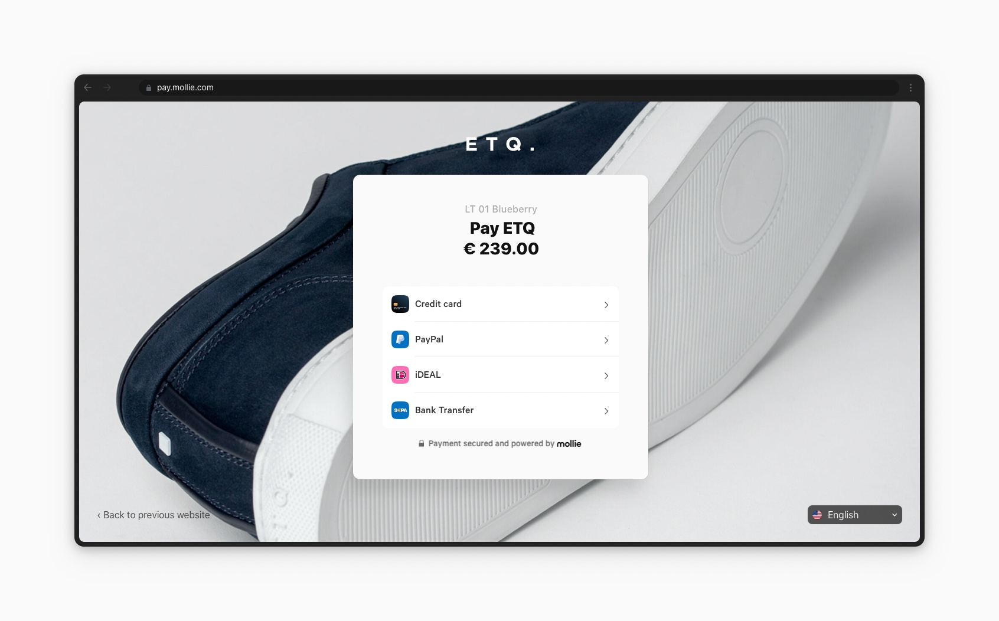
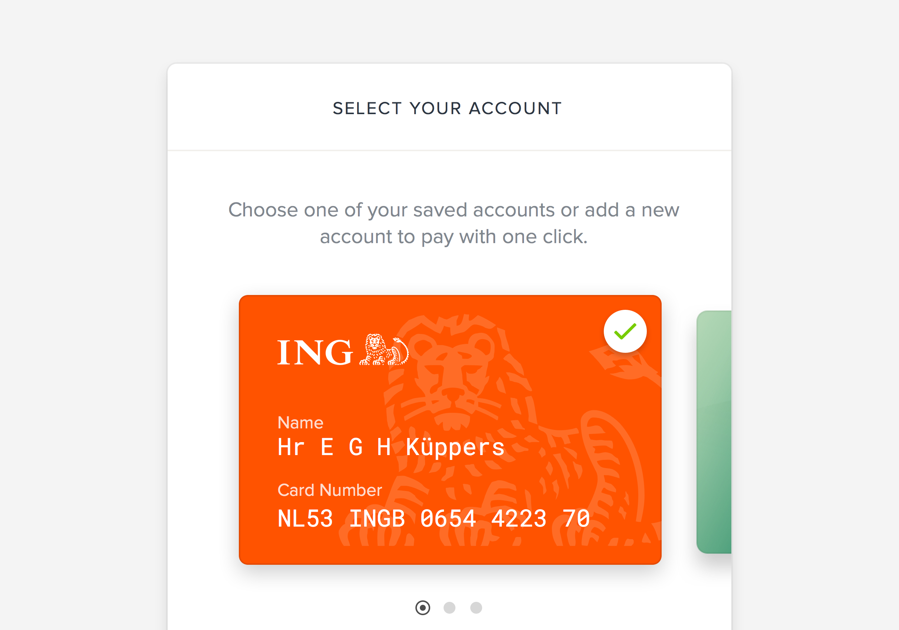

Mollie Checkout
===============
**Mollie Checkout** is a collection of *hosted payment pages* that allow your customers to pick payment methods or view
payment details for various methods. Using Mollie Checkout is optional but recommended.

For more information, visit our product page on `Mollie Checkout <https://www.mollie.com/en/checkout>`_.

Benefits of payments via the Mollie Checkout
--------------------------------------------
* Mollie's hosted payment pages are suitable for web, smartphones and tablets.

* All payment methods you have enabled are – when relevant – shown to your customers. A newly activated payment method
  is available immediately for all of your visitors.

* If the customer's first choice of payment method is not successful, it's very easy for the customer to select and try
  another one. If a customer appears to not have sufficient credit on a checking account a retry by credit card could
  easily be attempted. We handle this for you without asking you to implement any extra APIs.

* Full support for :doc:`QR codes </guides/qr-codes>`.

* Full support for wallets such as  :doc:`Apple Pay </wallets/applepay>`.

* Mollie optimizes the order of payment methods. For Dutch customers we know to list iDEAL at the top while for Belgians
  we start off with the payment method Bancontact. A lot of effort goes into this and we optimize this using
  A/B-testing. This way we improve your conversion without your effort.

Personalize your checkout
-------------------------
It is possible to customize the checkout by adding your own brand images. You can upload a logo and a wallpaper. The
example below shows a fully branded checkout page.

#. Go to your `Profiles <https://www.mollie.com/dashboard/settings/profiles>`_.
#. Click on a **Personalize Checkout** button.
#. Upload images within the specified restrictions.

   ETQ's Checkout with their logo (up top) and wallpaper (background).

Single Click payments for returning customers
---------------------------------------------
This feature allows your customers who have paid with
`credit card <https://www.mollie.com/en/payments/credit-card>`_ to complete their next payments with just one click. A
recognizable credit card with information gathered from the customers' previous payment is presented and allows the
customer to reuse this card. Single Click payments increase conversion.

#. Create a unique customer using the :doc:`Customers API </reference/v2/customers-api/create-customer>`.
#. Store the customer's ``id`` safely in your database. It's needed for performing Payments API calls for the customer.
#. Specify the ``customerId`` parameter each time you create a payment for this customer.
#. Returning customers are now shown the credit cards they have used in the past, enabling them to charge their card of
   choice with a single click.

   An example of the credit card selection screen shown to a returning customer.
