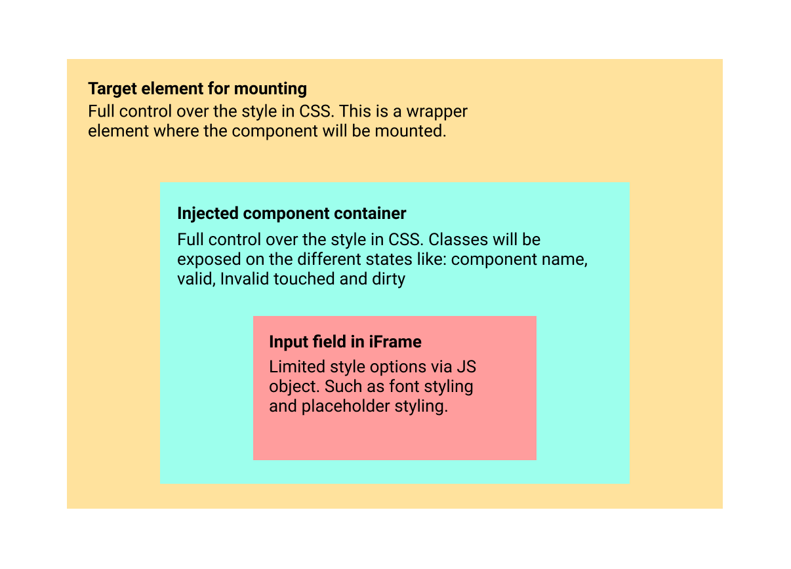

Styling Mollie Components
=========================
:doc:`Mollie Components <overview>` can be fully styled to ensure a smooth blend-in with your checkout. See our `Components Examples repository <https://github.com/mollie/components-examples>`_ for more info.

How to style a component
------------------------

Most of the styling should be applied to the injected ``.mollie-component`` container so no need to pass all the styling to the actual Component that lives inside the iFrame. The 
 container lives completely in your own environment and thus will give the most flexible way of styling. To see how this works please visit our `Components Examples repository <https://github.com/mollie/components-examples>`_ for examples. The idea is that css classes on the container will be set to reflect the state of the component. These are the classes we set on the container:

* ``mollie-component`` Will always be present. This will be a good class to style border and background properties.
* ``mollie-component--<component name>`` The component will be identified on the component name itself. This can be used to make exceptions on the mollie-component class for example margins.
* ``is-touched`` This class is set when the component on the first time it had focus. You may use this class in combination with another class to style the error for example.
* ``is-valid`` This class is set when the input is recognized as a valid input.  
* ``is-invalid`` This class is set when the input is recognized as an in valid input.
* ``has-focus`` This class is set when the component has focus. on blur this class will be removed. This class could be helpful to make an outline so the user knows the component is active. 

Inner styling options
---------------------
There is some styling that can’t be styled from outside the iFrame. This is because iFrames will block CSS inheritance. Some of these properties, such as typography related, can be applied when :doc:`creating components </guides/mollie-components/reference#mollie-createcomponent-type-options>` You can apply these styles to three states ``base``, ``valid`` and ``invalid``:

``base``
  The state of the Component when your customer has not entered any data yet or is entering data. These styles will also
  become the default styles for the ``valid`` and ``invalid`` states.

``valid``
  The state of the Component when your customer has entered valid data, such as a valid credit card number.

``invalid``
  The state of the Component when your customer entered invalid data, such as an expiry date in the past.

For each of these there is an set of properties you can use:

* ``backgroundColor`` of type ``color``
* ``color`` of type ``color``
* ``fontSize`` of type ``number``
* ``fontWeight`` of type ``string|number``
* ``letterSpacing`` of type ``number``
* ``lineHeight`` of type ``number``
* ``textAlign`` of type ``string``
* ``textDecoration`` of type ``string``
* ``textTransform`` of type ``string``

Every property has one or more types. Multiple types are indicated by a ``|`` character. We do not allow ``URL``,
``http``, ``https`` and ``www``.

* ``string`` A valid string, spaces aren't allowed,
* ``number`` A valid CSS number with an optional unit ``px``, ``em`` or ``rem``.
* ``color`` We accept colors as ``#f00``, ``#ff0000``, ``rgb(a)``, ``hsl(a)`` and ``transparent``,

We allow the following pseudo-classes. These will be autoprefixed and can be nested with the above listed properties.

* ``::placeholder``

Example
-------
Using styles with :ref:`components-mollie-create-component`: Please note: the majority of styling should be on the container as described above. For examples look at the `Components Examples repository <https://github.com/mollie/components-examples>`_ 

Javascript
^^^^^^^^^^
.. code-block:: js
   :linenos:

    var options = {
      styles : {
        base: {
          color: '#eee',
          fontSize: '10px',
          '::placeholder' : {
            color: 'rgba(68, 68, 68, 0.2)',
          }
        },
        valid: {
          color: '#090',
        }
      }
    };

    var cardNumberEl = mollie.createComponent('cardNumber', options)
