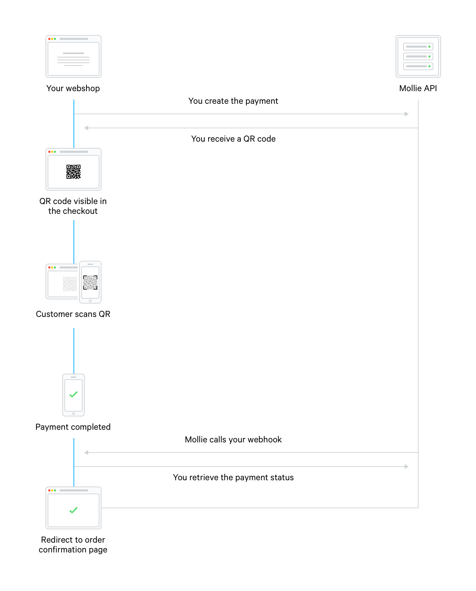

.. _guides/qr-codes:

QR codes
========
In the context of payments, `QR codes <https://en.wikipedia.org/wiki/QR_code>`_ enable customers to transfer the payment
flow from their desktop or laptop computer to their mobile device. This is the so-called *desktop-to-mobile* flow.

QR codes also allow your customers to pay without requiring manual input leading to lower error rates.

In most cases, this works by scanning a QR code during the payment using a dedicated app on a phone. For example,
Bitcoin payments support a QR code that can be scanned using a wallet app. The customer then completes the transaction
from his or her mobile device.

How do QR codes work?
---------------------
#. The merchant generates a QR code for a payment method using the Mollie API.
#. The QR code is presented to the customer during the checkout.
#. The customer opens the app on his or her mobile device and scans the QR code.
#. The customer finishes the payment in the app on the mobile device.
#. Mollie informs the merchant of the payment status change using the :ref:`webhook <guides/webhooks>`.
#. The customer is redirected back to the webshop on their computer.

Supported payment methods
-------------------------
+-------------+--------------------------------------------------------------------------------------------------------+
|iDEAL        |iDEAL QR codes can be scanned using the dedicated iDEAL app. The customer can select the issuer in the  |
|             |app and the payment flow is then transferred to the mobile banking app installed on the phone.          |
+-------------+--------------------------------------------------------------------------------------------------------+
|Bancontact   |Bancontact QR codes can be scanned using the Bancontact app, Belgian mobile banking apps or the iPhone  |
|             |camera app directly.                                                                                    |
+-------------+--------------------------------------------------------------------------------------------------------+
|Bank transfer|Many mobile banking apps support scanning EPC QR codes for SEPA credit transfers. Note that there is no |
|             |real-time feedback for this payment method.                                                             |
+-------------+--------------------------------------------------------------------------------------------------------+
|Bitcoin      |Most Bitcoin wallet apps support sending Bitcoins by scanning a QR code.                                |
+-------------+--------------------------------------------------------------------------------------------------------+

Implementation options
----------------------
Two options for implementation are available:

+---------------------+------------------------------------------------------------------------------------------------+
|Mollie Checkout      |:ref:`Mollie Checkout <guides/checkout>` contains QR codes at all the right places and handles  |
|                     |the QR code logic for your application. It supports real-time feedback to the customer after he |
|                     |/ she finishes the payment.                                                                     |
+---------------------+------------------------------------------------------------------------------------------------+
|Custom implementation|Should you want to, you can implement QR codes in your own application using the Mollie API.    |
|                     |Some special considerations need to be taken into account, they are listed below.               |
+---------------------+------------------------------------------------------------------------------------------------+

Custom implementation
---------------------
The QR code flow is largely similar to normal payment flow.

Retrieving QR codes
-------------------
The QR code can be retrieved by adding the ``details.qrCode`` include to the payment creation API call, as detailed in
the :ref:`Create payment <v2/payments-create>` reference.

``POST https://api.mollie.com/v2/payments?include=details.qrCode``

The API will return a ``qrCode`` object in the ``details`` object. The QR code can contain either a ``data:image/`` or a
``https://`` URL, depending on the payment method. You should support both.

QR codes are only included in the API as long as the payment has the ``open`` status. For iDEAL, the QR code is only
available if no issuer has been selected yet.

Redirecting the customer
------------------------
After the payment, we will call the webhook to inform your application of the payment status changes. Since the customer
has completed the payment on the mobile device, it is your task to ensure that a payment success page is automatically
shown to the customer on the desktop or laptop computer.

Preferably, you should use a real time channel like websockets to ensure an optimal checkout experience.

Note that after the payment, the customer will also be redirected to the ``redirectUrl`` on the mobile device for some
payment methods (such as iDEAL). For Bancontact, a special thank you page is shown on the mobile device.

For iDEAL you should make sure that the customer receives instructions to continue the shopping process on the device on
which he or she initiated the payment, and an instruction to close the window on the mobile device.
