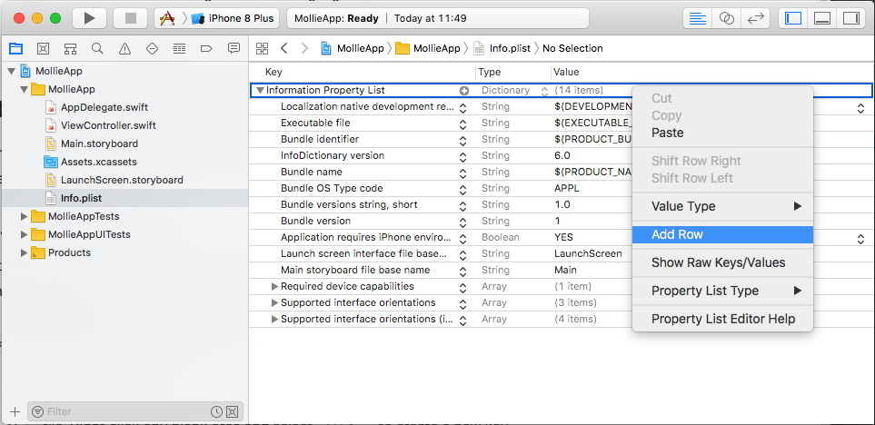
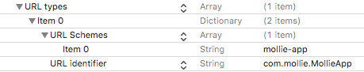

Getting started with Payments in your App
=========================================

Accepting payments in your app can improve conversion of orders from mobile devices. In this guide we will show you a
basic example of integrating Mollie Payments in your iOS or Android App.

.. note:: The code examples provided here are for illustrative purposes only and Mollie does not yet offer support on them.

Keep the guidelines of the platform you are developing on in mind
-----------------------------------------------------------------
Every platform has it's own guidelines for accepting of rejecting apps in the App Store or Marketplace. See
:ref:`app-store-r-r` for an in depth review.

Step 1: Create a Payment-creation script on your server
-------------------------------------------------------

Storing API keys in your app is insecure. Hence, you need to create a script on your server what you app can call to
create the payment for the app. The task of this script is to ensure that the Mollie APIs are called the way you want.

In particular, do **not** pass the amount from the app to your script but use your own business rules in the script to
prevent users of your app from messing with your payments. Remember that the app is installed on a device outside of
your control and thus untrusted.

You will need an API-key for this what you can find in your
`Dashboard <https://www.mollie.com/dashboard/developers/api-keys>`_. You will find examples in other languages in the
:doc:`/reference/v2/payments-api/create-payment` documentation.

.. code-block:: php
      :linenos:

      <?php

      // You have validated you are communicating with a trusted installation of your app.

      $mollie = new \Mollie\Api\MollieApiClient();
      $mollie->setApiKey("live_dHar4XY7LxsDOtmnkVtjNVWXLSlXsM");
      $payment = $mollie->payments->create([
            "amount" => [
                  "currency" => "EUR",
                  "value" => "10.00",
            ],
            "description" => "Order 12345",
            "redirectUrl" => "mollie-app://payment-return",
            "webhookUrl" => "https://webshop.example.org/payments/webhook/",
            "metadata" => [
                  "order_id" => "12345",
            ],
      ]);

      return $payment->getCheckoutUrl();

Ensure that this file can only be called by genuine installations of your own app.

.. _apps-configure-redirect-url:

Step 2: Configure your app to accept the Redirect URL
-----------------------------------------------------
We will be using a custom URL scheme to ensure your customer is redirected back to the app after the payment. Configure
iOS or Android to link your URL scheme with your app.

iOS
^^^
Go to your ``Info.plist`` file. Right click any blank area and select ``Add Row`` to create a new key.

You’ll be prompted to select a key from a drop-down menu. Scroll to the bottom and select ``URL types``. This creates
an array item. You can further click the disclosure icon to expand it and you need to select ``Item 0``. Expand that
row as well and you should see ``URL identifier``. Double-click the value field and fill in your identifier. Most of the
time will this be the same as your bundle ID, e.g. ``com.mollie.MollieApp``. Click on the plus-button next to ``Item 0``
and choose ``URL Schemes`` from the drop-down menu. Expand the ``URL Schemes`` row and another ``Item 0`` will show up.
Type in the value-field the scheme you want to handle, in our case ``mollie-app``. Make sure to pick a unique scheme.

Android
^^^^^^^
Open your ``AndroidManifest.xml`` file. Decide for what activity you want to support the URL scheme and add the following
code inside your ``<activity>`` object. Replace ``android:scheme`` with your URL scheme and ``android:host`` with the
commando, in our example ``payment-return``.

.. code-block:: xml
      :linenos:

        <intent-filter>
            <data
                android:host="payment-return"
                android:scheme="mollie-app" />
            <action android:name="android.intent.action.VIEW" />
            <category android:name="android.intent.category.DEFAULT" />
            <category android:name="android.intent.category.BROWSABLE" />
        </intent-filter>

Step 3: Call your server and open the Checkout URL
--------------------------------------------------
To initiate a payment from your app you need to call the file you have created in step 1 and open
the browser with the Checkout URL you will receive. **Do this in the native browser of the device
and not in an in-app browser view** since the operating systems will reject opening the bank apps
from these views. If the ``method`` supports a ``mobileAppCheckout`` URL, use that URL as redirect
instead of the regular ``checkout`` URL. This will open the banking app directly from your app
without opening the browser. This will improve the flow for your consumer.

.. warning:: Never send an amount to your server for creating a payment to prevent price changes
             between the payment and the actual price the customer needs to pay.

iOS
^^^

.. code-block:: swift
      :linenos:

      func startPayment(order: Order) {
            let parameters = ["orderId": order.id]
            let url        = URL(string: "https://www.thisismylink.com/api/create-payment")!
            let session    = URLSession.shared

            var request        = URLRequest(url: url)
            request.httpMethod = "POST"

            do {
                  request.httpBody = try JSONSerialization.data(withJSONObject: parameters, options: .prettyPrinted)
            } catch let error {
                  print(error.localizedDescription)
            }

            let task = session.dataTask(with: request as URLRequest, completionHandler: { data, response, error in

                  guard error == nil else {
                        return
                  }

                  guard let data = data else {
                        return
                  }

                  do {
                        UIApplication.shared.open(NSURL(string: response)! as URL)
                  } catch let error {
                        print(error.localizedDescription)
                  }
            })
            task.resume()
      }

Android
^^^^^^^
We use the `OkHttp <https://github.com/square/okhttp>`_ library in this example. Therefor, add the following line to
your Project's ``build.gradle`` file:

.. code-block:: bash
   :linenos:

   compile 'com.squareup.okhttp3:okhttp:3.5.0'

**Java**

.. code-block:: java
    :linenos:

    private void startPayment(Order order) {
        OkHttpClient client = new OkHttpClient();

        RequestBody requestBody = new MultipartBody.Builder()
            .setType(MultipartBody.FORM)
            .addFormDataPart("orderId", order.getId())
            .build();

        Request request = new Request.Builder()
            .url("https://www.thisismylink.com/api/create-payment")
            .post(requestBody)
            .build();

        try {
            response = client.newCall(request).execute();
        } catch (IOException e) {
            e.printStackTrace();
        }

        if (response == null || !response.isSuccessful()) {
            Log.w("Create Payment", "HTTPS-call failed");
        } else {
            Intent browserIntent = new Intent(Intent.ACTION_VIEW, Uri.parse(response.body().string()));
            startActivity(browserIntent);
        }
    }

**Kotlin**

.. code-block:: kotlin
    :linenos:

    private fun startPayment(order: Order) {
        OkHttpClient client = new OkHttpClient();

        RequestBody requestBody = new MultipartBody.Builder()
            .setType(MultipartBody.FORM)
            .addFormDataPart("orderId", order.id)
            .build();

        Request request = new Request.Builder()
            .url("https://www.thisismylink.com/api/create-payment")
            .post(requestBody)
            .build();

        try {
            response = client.newCall(request).execute();
        } catch (e: IOException) {
            e.printStackTrace();
        }

        if (response === null || !response.isSuccessful()) {
            Log.w("Create Payment", "HTTPS-call failed");
        } else {
            val browserIntent = Intent(android.content.Intent.ACTION_VIEW)
            browserIntent.data = Uri.parse(response.body().string())
            startActivity(browserIntent);
        }
    }

Step 4: Handle the redirect
---------------------------
We return the customer back to your App after the payment is paid or canceled. You should tell the App what to do with
this request.

iOS
^^^
Open your ``AppDelegate.swift`` file and add the ``application(_:open:options)`` method. Split out the host into an array
so you can access the data that we return. Your method should return ``true`` to let the device know that you can handle
the request.

.. code-block:: swift
      :linenos:

      func application(_ app: UIApplication, open url: URL, options: [UIApplicationOpenURLOptionsKey : Any] = [:]) -> Bool {
        if (url.host! == "payment-return") {
            let queryItems = URLComponents(url: url, resolvingAgainstBaseURL: false)?.queryItems
            let paymentId = queryItems?.filter({$0.name == "id"}).first

            // Optional: Do stuff with the payment ID

            return true;
        }

        return false;
      }

Android
^^^^^^^
Open the class that you have specified in your ``AndroidManifest.xml`` as handler for the URL scheme. And should add the
handling code in the ``onCreate`` method.

**Java**

.. code-block:: java
      :linenos:

      public void onCreate(Bundle savedInstanceState)
      {
            super.onCreate(savedInstanceState);

            //...

            Intent intent = getIntent();
            if (Intent.ACTION_VIEW.equals(intent.getAction())) {
                  Uri uri = intent.getData();
                  String paymentId = uri.getQueryParameter("id");

                  // Optional: Do stuff with the payment ID
            }
      }

**Kotlin**

.. code-block:: kotlin
      :linenos:

      override fun onCreate(savedInstanceState: Bundle){
            super.onCreate(saveInstanceState)

            // ...

            val action: String? = intent?.action
            if (action === android.content.Intent.ACTION_VIEW) {
                  val data: Uri? = intent?.data
                  val paymentId: String? = data.getQueryParameter("id")

                  // Optional: Do stuff with the payment ID
            }
      }

Step 5: Share the status of the payment with your App
-----------------------------------------------------
Since the API-key is not included in your App, you can not request the status of the payment directly from Mollie.
Therefor you should create a way to inform your App about the status update of the payment from your server. An option
you have is to use a Silence Notification. Please see the guides for
`iOS <https://developer.apple.com/documentation/usernotifications/setting_up_a_remote_notification_server/pushing_updates_to_your_app_silently>`_
and `Android <https://firebase.google.com/docs/cloud-messaging/concept-options#notifications_and_data_messages>`_ about
how to integrate this in your App.
