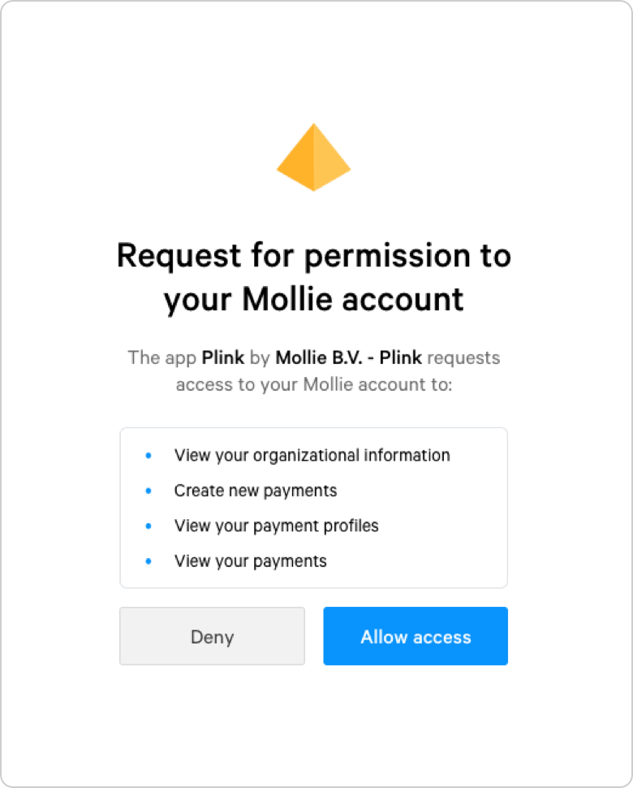

Mollie Connect: Getting started
===============================
Assuming you have already built an OAuth-compatible app, the first step is to `register your app in your
Dashboard <https://www.mollie.com/dashboard/developers/applications>`_. You will receive a *Client ID* and
*Client Secret*, both of which should be kept secret. These credentials can be used to:

* Redirect users to your app's authorization form (*Client ID*)
* Exchange auth codes for access tokens (*Client ID* & *Client Secret*)
* Renew your access tokens
* Deauthorize users from your app (*Client ID* & *Client Secret*)

Configuring your OAuth app
--------------------------
Use the details below to configure your app to work with our platform.

* **Client ID**: received upon app registration
* **Client Secret**: received upon app registration
* **Redirect URL**: a URL within your app that processes authorizations
* **Authorization URL**: ``https://www.mollie.com/oauth2/authorize``, see the
  :doc:`Authorize endpoint </reference/oauth2/authorize>`
* **Access token URL**: ``https://api.mollie.com/oauth2/tokens``, see the
  :doc:`Tokens endpoint </reference/oauth2/tokens>`
* **Resource owner URL**: ``https://api.mollie.com/v2/organizations/me``, see
  :doc:`Get organization </reference/v2/organizations-api/get-organization>`

Getting a merchant’s consent
----------------------------
After having registered and configured your app, you can send the merchant to Mollie through the default authorization
URL as configured in your OAuth app. Good practice is to show a *Connect with Mollie* button which redirects the
merchant to :doc:`the authorization screen </reference/oauth2/authorize>`.

When you send a merchant to the authorization screen, Mollie will tell the merchant what data your app has requested
access to, and request the merchant to confirm the authorization. An example authorization is shown below.

Working with access tokens
--------------------------
The merchant will be redirected back to your app, along with an *auth code*. With the auth code, you
can :doc:`retrieve </reference/oauth2/tokens>` an *access token* using default OAuth library functionality.

Note access tokens are time limited - you need to refresh them
periodically using the *refresh token*. An access token expires after 1 hour. A refresh token does not expire.

Once you have the access token, use the :doc:`/reference/v2/organizations-api/current-organization` to
see which organization authenticated to your app. This endpoint also allows you to retrieve the
merchant's preferred locale. It is recommended to switch your app's locale to the merchant's locale after the OAuth flow.

Using the access token on the Mollie API, your app may now access the merchant's account data, allowing the merchant to
start using your app.
