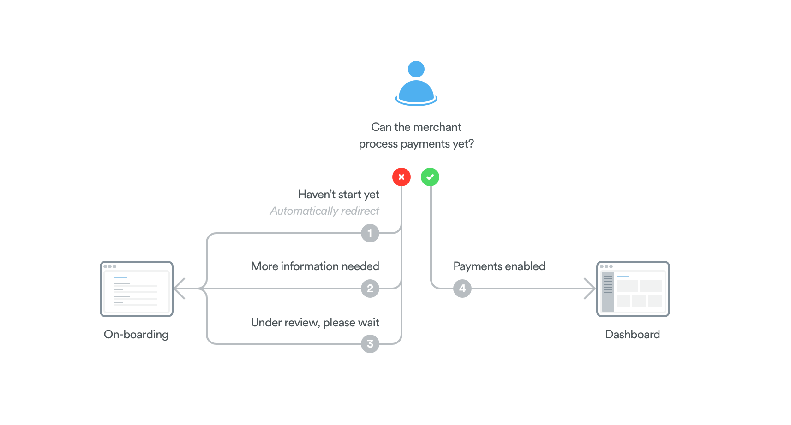

Onboard your customers at Mollie
================================
This guide will help you with the process of getting your customers onboard at Mollie. From the first OAuth permission
to sending data about your customer, all steps will be covered. It also covers our Hosted Onboarding feature.

We are using the concept of a new customer but you can use the Onboarding APIs also for existing merchants that have
already an account at Mollie.

.. note:: In this guide we assume that you have already created an OAuth app in the Mollie Dashboard. If you do not know
          how to do this, please see the :doc:`Getting started guide </oauth/getting-started>`.

Prerequisites
-------------
If you have access to our Hosted Onboarding-feature and want to use this, you need to `turn on hosted onboarding
<https://www.mollie.com/dashboard/settings/hosted-onboarding>`_ in the Mollie Dashboard.

You will have to provide a logo, name and redirect URL for the OAuth app that will be automatically created.

That page will display the Client ID and secret needed for the steps below.

Step 1: Setting up the authorization
------------------------------------

You will need to acquire authorization for the
Mollie account your customer creates or logs into. This :doc:`page </oauth/overview>` gives you an overview of the flow. If you just want to follow the implementation steps, follow this guide: :doc:`Mollie Connect getting started </oauth/getting-started>`.

  .. note::  Make sure to use the Client Id and secret provided of the Hosted Onboarding APP if you want to use this feature. These can be found in the `hosted onboarding settings <https://www.mollie.com/dashboard/settings/hosted-onboarding>`_.

Require the following scopes to board merchants and create payments on their behalf:

.. list-table::
   :widths: auto

   * - | ``payments.write``
       | Payments API
     - Create payments for the merchant. The received payment will be added to the merchant's balance.

   * - | ``organizations.write``
       | Organizations API
     - Change the merchant's organizational details.

   * - | ``onboarding.read``
       | Onboarding API
     - View the merchant's onboarding status.

   * - | ``onboarding.write``
       | Onboarding API
     - Submit onboarding data for the merchant.

Step 2: Customer signs up / logs in and gives authorization
-----------------------------------------------------------
Once you send your customer to the authorize URL they will see a welcome screen.
This page informs the customer that the application is using Mollie to create payments.

When the customer continues they will be shown a signup form (they can also login if they already have an account). Then, the OAuth permission screen will ask for permissions to view their onboarding status and submit data.

.. image:: ../oauth/images/oauth-permission-onboarding@2x.png

Step 3: Customer returns from authorization
-------------------------------------------
After the authorization, the customer will be sent to the redirect URL of the application.

  .. note::  A query string containing an auth code will be added to the redirect URL, for example: ``https://www.yourapp.com/payments/settings?code=bvS9VpCVbvBrQVfSdG9F3aNtWszdQnzz``

You can now generate the OAuth access tokens for this customer using the :doc:`Generate tokens endpoint </reference/oauth2/tokens>` and store them. You will use this token for all the requests regarding that customer.

Step 4: Customer starts onboarding
----------------------------------
You can now check the Onboarding Status of your customer using the :doc:`Get onboarding status endpoint </reference/v2/onboarding-api/get-onboarding-status>`

We recommend to handle the status of the customer like shown in the following flowchart:

If your customer just completed the authorization step and the onboarding status from the previous request was ``needs-data``, you probably want the customer to immediately start the Onboarding process with Mollie.

In that situation you will want to redirect them straight to the onboarding URL instead of them landing in the platform. **This is only possible if Hosted Onboarding is activated.** The Hosted Onboarding URL is received in the Get Onboarding Status call.

On the other hand, if they need to start the onboarding in Mollie but didn't just authorize, you can just show them the default "need-data" view that we will detail in the next step.

To make your customer experience easier, you can help them onboard at Mollie by prefilling some fields using the :doc:`Submit onboarding data endpoint </reference/v2/onboarding-api/submit-onboarding-data>`. This can happen before you redirect the customer towards the Hosted Onboarding URL.

Step 5: Customer needs to complete the onboarding
-------------------------------------------------
The :doc:`Onboarding status </reference/v2/onboarding-api/get-onboarding-status>` response is used to display a proper message and action to your customer.

There's two milestones that the customer reaches during the Mollie onboarding, ``canReceivePayments`` (basic information has been provided) and ``canReceiveSettlements`` (all information has been provided and verified).

There's also the `status`: ``needs-data``, ``in-review`` and ``completed``

As a basic implementation, we recommend handling the following cases:

1) Payments are **not** enabled and the status is ``needs-data``

  .. code-block:: javascript
    :linenos:

      {
        canReceivePayments: false,
        canReceiveSettlements: false,
        status: "needs-data"
      }

  .. list-table::
    :widths: auto

    * - | ``Key information``
      - `Before you can accept payments, Mollie needs more information.`

    * - | ``Action``
      - `Continue with Mollie` (link to Onboarding URL)

2) Payments are enabled and the status is ``needs-data``

  .. code-block:: javascript
    :linenos:

      {
        canReceivePayments: true,
        canReceiveSettlements: false,
        status: "needs-data"
      }

  .. note::  If you are only interested in your merchants accepting payments, you should redirect them to your default landing page.

  .. list-table::
    :widths: auto

    * - | ``Key information``
      - `You are ready to start accepting payments. Before Mollie can pay out to your bank, you will need to provide some additional information.`

    * - | ``Action``
      - `Complete your Mollie account` (link to Onboarding URL)

3) Payments are **not** enabled and the status is ``in-review``

  .. code-block:: javascript
    :linenos:

      {
        canReceivePayments: false,
        canReceiveSettlements: false,
        status: "in-review"
      }

  .. list-table::
    :widths: auto

    * - | ``Key information``
      - `Mollie has all the required information and is verifying your details.`

    * - | ``Action``
      - `None`

4) Payments are enabled and the status is ``in-review``

  .. code-block:: javascript
    :linenos:

      {
        canReceivePayments: true,
        canReceiveSettlements: false,
        status: "in-review"
      }

  .. list-table::
    :widths: auto

    * - | ``Key information``
      - `You are ready to start accepting payments. Mollie is verifying your details to enable settlements.`

    * - | ``Action``
      - `None`

5) Payments and settlements are enabled and status is ``completed``

  .. code-block:: javascript
    :linenos:

      {
        canReceivePayments: true,
        canReceiveSettlements: true,
        status: "completed"
      }

  .. list-table::
    :widths: auto

    * - | ``Key information``
      - `Setup is complete 🎉`

    * - | ``Action``
      - `None`
