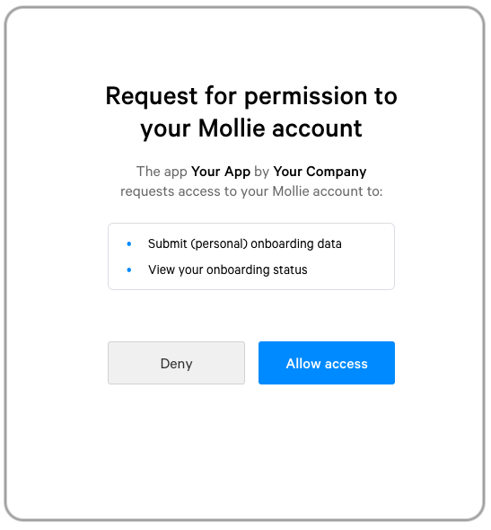

Onboard your customers at Mollie
================================
This guide will help you with the process of getting your customers onboard at Mollie. From the first OAuth permission
to sending data about your customer, all steps will be covered.

We are using the concept of a new customer but you can use the Onboarding APIs also for existing merchants that have
already an account at Mollie.

.. note:: In this guide we assume that you have already created an OAuth app in the Mollie Dashboard. If you do not know
          how to do this, please see the :doc:`Getting started guide </oauth/getting-started>`.

Step 1: Create a page with the Mollie Connect button
----------------------------------------------------
We start off with creating a page where we can find a button to register a Mollie account. You can use our button for this
but creating an own button is also possible. For the official "Connect via Mollie" button, see :ref:`connect-button`.

For using this flow we need, besides your self chosen scopes, permission to the scopes ``onboarding.read`` and
``onboarding.write``. Besides that, we are using our OAuth app Client ID and a random string for the state to prevent
CSRF-attacks. We can now compose the authorize URL as described in the :doc:`Authorize endpoint </reference/oauth2/authorize>`.

Step 2: Your customer signs up and gives permission
---------------------------------------------------
Once you redirected your customer to the authorize URL he or she will see the Mollie login screen. By clicking on the
signup link the customer can create their Mollie account. When you are a partner of Mollie which can receive commission
for referred customers, the process of connecting the customers to your partner account will happen automatically on sign
up. After signing up, the OAuth permission screen will be shown and your customer should give your app permission to view
their onboarding status and submitting data.

Step 3: Check the onboarding status and deliver data
----------------------------------------------------
Now you have permission to view the onboarding status you can check in what stage your customer is at Mollie. Use the
:doc:`Get onboarding status endpoint </reference/v2/onboarding-api/get-onboarding-status>` to do this. You will also
find a link to the onboarding in the response of the endpoint so you can send your customer to the onboarding directly if
you want to. Before sending your customer to it, you can submit data about the customer what will be prefilled in the
onboarding of Mollie.

Submitting data from your customer is possible via the
:doc:`Submit onboarding data endpoint </reference/v2/onboarding-api/submit-onboarding-data>`. as long as status of the
account is ``needs-data``. Sending data should be done before sending your customer to the onboarding,
otherwise it can happen that your submitted data is not prefilled at the moment your customer arrives at the onboarding
pages.

Step 4: Wait for your customer to complete the onboarding
---------------------------------------------------------
Depending on your application or service you will need to wait until your customer is able to receive payments or
settlements. Since we do not have any webhook available for the onboarding status, you should call the
:doc:`Get onboarding status endpoint </reference/v2/onboarding-api/get-onboarding-status>` by yourself once in a while to
see if your customer reaches the point in the onboarding you require to start working with.

.. warning:: Customers who were rejected as a merchant of Mollie, for any reason, will be deactivated. Therefore it is not
             possible anymore to get access via OAuth what makes it impossible to get the onboarding status from that
             moment on.