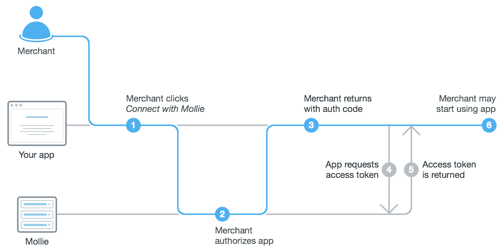

.. _oauth/overview:

Mollie Connect: Overview
========================

Mollie Connect allows you to create apps for Mollie merchants via OAuth.

Why should I use OAuth?
-----------------------
Mollie Connect is built on the `OAuth standard <https://en.wikipedia.org/wiki/OAuth>`_. The OAuth connection enables you
to access other merchants' accounts with their consent, without having to exchange API keys. Whether you are just
looking to improve your customers' experiences, to automate essential business processes, or to whitelabel our platform
completely, it is all possible with OAuth.

Our OAuth platform allows you to:

* Create payments and refunds on behalf of merchants
* Manage merchants' website profiles
* View a merchants' transaction and settlement data
* Show the next settlement and balance at Mollie in your app
* Integrate merchants' invoices from Mollie in your app
* Charge merchants for payments initiated through your app (:ref:`application fees <oauth/application-fees>`)

What does the Mollie OAuth flow look like?
------------------------------------------
After you've :ref:`registered your OAuth app with Mollie <oauth/getting-started>`, other Mollie merchants are able to
install your app on their Mollie account. To do so, they have to follow the well known OAuth *authorization flow* as
visualized below.

The authorization flow is explained in further detail in :ref:`OAuth: Getting started <oauth/getting-started>`.

What merchant data can I access?
--------------------------------
As with all OAuth platforms, you tell Mollie what data you need when requesting an authorization by listing the
permissions your app requires. The merchant will explicitly have to agree with any permissions you request, so be sure
to only request necessary permissions.

Please refer to :ref:`OAuth: Permissions <oauth/permissions>` for a full list of available permissions.

How do merchants install my app?
--------------------------------
By implementing the authorization flow, other Mollie merchants are able to install your app on their Mollie account.
:ref:`OAuth: Getting started <oauth/getting-started>` discusses authorizations in further detail.

The Connect with Mollie button
------------------------------
To keep the user experience consistent, we recommend using one of the buttons below in your authorization flow.

.. image:: images/button-small@2x.png

`Download files <https://www.mollie.com/assets/images/branding/connect-button/connect-with-mollie.zip>`_

The download includes a Sketch file and retina PNGs.
