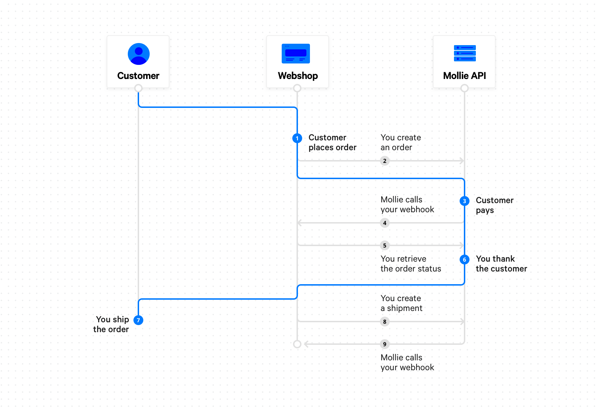

Orders API
==========
.. warning::
   This API is currently in private beta. If you are interested in participating, please contact your account manager at
   Mollie.

The **Orders API** allows you to use Mollie for your order management. *Pay after delivery* payment methods, such as
*Klarna Pay later* and *Klarna Slice it* require the Orders API and cannot be used with the
:doc:`Payments API </payments/overview>`.

How does the Orders API work?
-----------------------------

#. A customer on your webshop decides to checkout.

#. For every order in your webshop, you create an order using the
   :doc:`Create Order API </reference/v2/orders-api/create-order>`.

#. The :ref:`Create Order API response <get-order-response>` contains the ``_links.checkout`` property. This is a link
   where you should redirect your customer to for checking out.

#. If the checkout is successful, the order will change it's state to ``authorized`` or ``paid``, depending on the
   payment method used by your customer.

   We will use webhooks to inform your back office of the order state change.

#. Processing the webhook request your website :doc:`fetches the order status </reference/v2/orders-api/get-order>`
   using the Mollie API. This fetched status serves to mark the payment paid, trigger fulfilment and send out an email
   confirmation to the customer.

#. At this point Mollie returns the visitor to your website using the ``redirectUrl`` specified when the order was
   created. Your website already knows the payment was successful and thanks the customer.

#. When the order is ``paid`` or ``authorized`` you can ship the order to your customer.

#. Once you start shipping the order, you should send the shipment information to Mollie using the
   :doc:`Create Shipment API </reference/v2/shipments-api/create-shipment>`. Alternatively, you can use the Mollie
   Dashboard. You should ship the order within 28 days or the order will expire.

   For some payment methods, shipping is required to ensure you will be settled for the full order amount.

   We will use webhooks to inform your back office that a shipment was created.

#. Processing the webhook request your website :doc:`fetches the order status </reference/v2/orders-api/get-order>`
   using the Mollie API. You can check if a shipment has created and process this in your own system, if desired.

Cancel order lines
------------------
If there are some lines in the order you will not ship, you can cancel them using the
:doc:`Cancel order lines API </reference/v2/orders-api/cancel-order-lines>` if they are ``authorized`` or you can
:doc:`create refunds </reference/v2/orders-api/create-order-refund>` if the lines are already ``paid``.

Order expiry
------------
An order expires after 28 days. Any authorizations on the order will be released. You can check the ``expiresAt``
property on the order or in the Mollie Dashboard to see when the order expires exactly.
