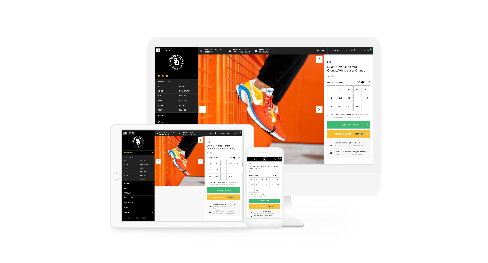

Integrating PayPal Express Checkout button
==========================================

The PayPal Express Checkout button offers your customers another way to pay, and it complements your existing PayPal
payment flow. It will provide a one-click checkout solution without the need of asking the billing and shipping addresses.
This allows you to place the button on any page in your webshop, like the product page.

The button
----------
We recommend you to use the button that we provide in the `Mollie Resources <https://www.mollie.com/en/resources>`_
pack. This button is recognizable to customers and improves checkout conversion. Of course it's also possible to design
and use your own button, according to the PayPal brand guidelines.

Account requirements
--------------------
The button can be used when your account is fully setup at PayPal and Mollie. Make sure that your
account is a `PayPal Business account <https://www.paypal.com/us/webapps/mpp/referral/paypal-business-account2>`_
and that you linked your PayPal account to Mollie as described in our
`help center article <https://help.mollie.com/hc/en-us/articles/213856625>`_.

Integration steps
-----------------
Using the button requires the Orders API. You can use your existing integration with the Orders API with only
some small tweaks. You can use the following steps as a guideline for the basic integration:

#. Place the button on the intended page, like a product page.

#. Your website :doc:`creates an order </reference/v2/orders-api/create-order>` via the Orders API after the consumer
   clicks the button. Make sure you set the method to ``paypal`` so that the ``billingAddress`` field will not be required
   anymore.

   .. note:: Once the order is created, the amount can not be changed. When calculating shipping costs and/or taxes, be
             sure to include them when creating the order.

   .. warning:: The ``billingAddress`` stays required for every other method. If you set another method, or no method at
                all, your request will result in an HTTP status code ``422 Unprocessable Entity``.

#. Redirect your customer to the ``checkout`` URL which you can find in the response of the Create Order
   API. The customer will select the address where the product(s) needs to be sent to and complete the
   payment.

#. Mollie will receive the address from PayPal and updates the order's ``shippingAddress`` only if there is no 
   ``shippingAddress`` set already. The consumer will  then be redirected back to your website while we call your webhook, 
   if set, to inform you about the latest order state.

#. You can retrieve the shipping address by calling the :doc:`Get order endpoint </reference/v2/orders-api/get-order>`
   and finish your order to ship the product(s).

   .. warning:: PayPal returns the ``shippingAddress`` to us, but it does not return the ``billingAddress``. That info is not 
      contained in the API response from PayPal, and we have no way of retrieving that. We instead use the ``shippingAddress``, 
      returned to us by PayPal, as the order's ``billingAddress``.