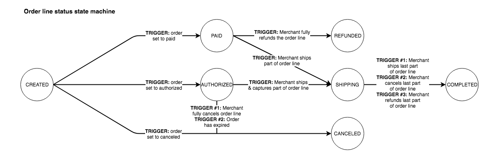

Order status changes
====================
Depending on what happens orders and order lines go through a number of statuses. First we will discuss the possible
statuses for orders and how they are connected. Then we will show the possible statusses for order lines.

Every possible order status
-----------------------------
The following diagram shows how one order status leads to another:

.. image:: images/order-status-flow@2x.png

``created``
    The order has been created, but nothing else has happened yet.

    * This is not a status Mollie will call your webhook for.
    * All order lines will also be in the ``created`` state.
    * Can transition to: ``paid``, ``authorized``, ``canceled``.

``paid``
    The order status will be set to this status when the order's payment is successfully completed with a payment method
    that transfers the money immediately.

    * Mollie will call your webhook when the order reaches this state.
    * Order lines can be in the state ``paid`` or ``refunded``. Not all lines are ``refunded``.
    * Can transition to: ``shipping`` and ``refunded``.

``authorized``
    If the order's payment is successfully completed with a payment method that does not transfer the money immediately,
    the order is set to this status. The money will only be transferred once a shipment is created for the order.
    Currently only Klarna Pay Later uses this status.

    * Mollie will call your webhook when the order reaches this state.
    * Order lines can be in the state ``authorized`` or ``canceled``. Not all lines are ``canceled``.
    * Can transition to: ``shipping``, ``canceled`` and ``expired``.

``shipping``
    The order will move into this state when you start shipping your first order lines. When the order is in this state,
    it means that you still have some order lines that are not shipped yet.

    * This is not a status Mollie will call your webhook for.
    * Order lines can be in the states ``paid``, ``authorized``, ``shipping``, ``completed``, ``refunded`` or
      ``canceled``. At least one line should be in ``paid`` or ``authorized`` and at least one other line should be
      ``completed``.
    * Can transition to: ``completed``.

``completed``
    When all order lines are shipped or canceled, the order will be set to this status. At least one line should be
    shipped. If all lines are canceled, the status of the order will change to ``canceled`` instead.

    * Mollie will call your webhook when the order reaches this state.
    * Order lines can be in the states ``completed``, ``canceled`` or ``refunded``. At least one line should be
      ``completed``.
    * This is a final state, the order can't transition to another state.

``canceled``
    When all order lines are canceled, the order is also set to canceled.

    * Mollie will call your webhook when the order reaches this state.
    * All order lines will also be in the ``canceled`` state.
    * This is a final state, the order can't transition to another state.

``refunded``
    When an order was paid with a payment method that transfers the money immediately, but the order was completely
    canceled, the order will be set to this status.

    Note that this status is not used when you refund orders or order lines after you have shipped them. In that case
    the status will stay at ``completed``.

    * Mollie will call your webhook when the order reaches this state.
    * All order lines will also be in the ``refunded`` state.
    * This is a final state, the order can't transition to another state.

``expired``
    The order will expire when an order is not shipped in time after an authorization. This is currently 28 days but
    might change in the future.

    * Mollie will call your webhook when the order reaches this state.
    * All order lines will be ``canceled``.
    * This is a final state, the order can't transition to another state.

Every possible order line status
--------------------------------
The following diagram shows how one order line status leads to another:

``created``
    The order line has been created, but nothing else has happened yet.

    * The order will also be in the ``created`` state.
    * Can transition to: ``paid``, ``authorized`` and ``canceled``.

``paid``
    The order line status will be set to this status when the order's payment is successfully completed with a payment
    method that transfers the money immediately.

    * The order has status ``paid`` or ``shipping``.
    * Can transition to: ``shipping`` or ``refunded``.

``authorized``
    If the order's payment is successfully completed with a payment method that does not transfer the money immediately,
    the order lines are set to this status. The money will only be transferred once a shipment is created for the order
    line. Currently only Klarna Pay Later uses this status.

    * The order has status ``authorized`` or ``shipping``.
    * Can transition to: ``shipping`` or ``canceled``.

``shipping``
    The order line will move into this status when you ship only a part of the order line. If you ship the complete
    order line, the status will move to ``completed`` immediately.

    * The order has status ``shipping``.
    * Can transition to: ``completed``.

``completed``
    When the order line is completely shipped, it will get this status. The order line will also get this status when it
    is partially shipped and the rest of the line is ``canceled`` or ``refunded``.

    * The order has status ``shipping`` or ``completed``.
    * This is a final state, the order line can't transition to another state.

``canceled``
    When the complete order line is canceled, the line gets this status. If only part of the order line is canceled, the
    status will stay at its previous status.

    * The order has status ``authorized``, ``shipping``, ``completed``, ``expired`` or ``canceled``.
    * This is a final state, the order line can't transition to another state.

``refunded``
    When an order was paid with a payment method that transfers the money immediately, and the order line was completely
    canceled, the order line will be set to this status.

    Note that this status is not used when you refund order lines after you have shipped them. In that case the status
    will stay at ``completed``.

    * The order has status ``completed`` or ``refunded``.
    * This is a final state, the order line can't transition to another state.
