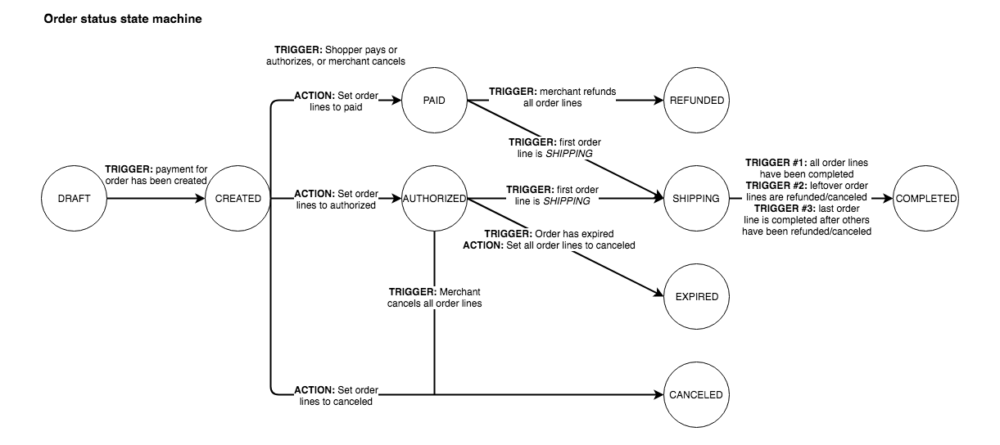
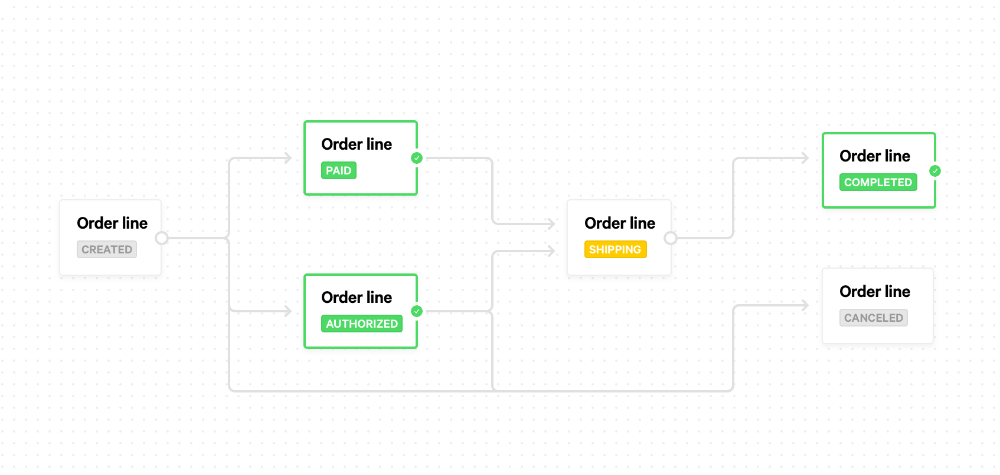

Order status changes
====================
Orders and order lines can go through a number of different statuses. First we will discuss the difference between
two possible flows for orders. After that we will list all the possible statuses for both **orders** and
**order lines**.

Two flows: authorized and paid
------------------------------
There are basically two different flows for an order, depending on the payment method that is used to pay the order.

Authorized
^^^^^^^^^^
Some payment methods support *authorizations*. This means that a consumer can authorize a payment, but it will not be
executed immediately. It will give us all the needed information to process the payment at a later point. This execution
is called a *capture*.

If the payment method supports authorizations, the consumer will authorize a payment when the order is created. If the
authorization is successful, the order will have status ``authorized``.

Each time a :doc:`shipment is created </reference/v2/shipments-api/create-shipment>`, we will automatically execute a
capture too. The shipment can be for the whole order or for only a part of the order. Only the amount that is shipped
will be captured.

Paid
^^^^
If a payment method does not support authorizations, the payment will be paid immediately when the order is created. You
can create shipments for these orders just like in the *authorized* flow, but it won't have any effect on the payment.

Possible statuses for orders
----------------------------
The following diagram shows how one order status leads to another:

.. _order-status-created:

``created``
^^^^^^^^^^^
    The order has been created, but nothing else has happened yet.

    * This is not a status Mollie will call your webhook for.
    * All order lines will also be in the ``created`` state.
    * Can transition to: ``paid``, ``pending``, ``authorized``, ``expired`` and ``canceled``.

.. _order-status-paid:

``paid``
^^^^^^^^
    The order status will be set to this status when the order's payment is successfully completed with a payment method
    that does not support authorizations.

    * Mollie will call your webhook when the order reaches this state.
    * All order lines will also be in the ``paid`` state.
    * Can transition to: ``shipping`` and ``completed``.

.. _order-status-pending:

``pending``
^^^^^^^^^^^
    It is possible that the payment supplier will manually check an order. In that case we will set the order to this
    status. It can take a couple of days before the order is set to another status. Currently only *Klarna Pay later*
    and *Klarna Slice it* use this status.

    * This is not a status Mollie will call your webhook for.
    * All order lines will be ``created``.
    * Can transition to: ``authorized`` and ``created``. 

.. _order-status-authorized:

``authorized``
^^^^^^^^^^^^^^
    If the order's payment is successfully completed with a payment method that does support authorizations, the order
    is set to this status. The money will only be transferred once a shipment is created for the order. Currently only
    *Klarna Pay later* and *Klarna Slice it* use this status.

    * Mollie will call your webhook when the order reaches this state.
    * Order lines can be in the state ``authorized`` or ``canceled``. Not all lines are ``canceled``.
    * Can transition to: ``shipping``, ``canceled`` and ``expired``.

.. _order-status-shipping:

``shipping``
^^^^^^^^^^^^
    The order will move into this state when you start shipping your first order line or part of an order line. When
    the order is in this state, it means that you still have some order lines that are not shipped yet.

    * This is not a status Mollie will call your webhook for.
    * Order lines can be in the states ``paid``, ``authorized``, ``shipping``, ``completed`` or ``canceled``. At
      least one line should be in state ``paid`` or ``authorized`` and at least one other line should be in state
      ``shipping`` or ``completed``.
    * Can transition to: ``completed``.

.. _order-status-completed:

``completed``
^^^^^^^^^^^^^
    When all order lines are completed or canceled, the order will be set to this status. At least one line should be
    completed. If all lines are canceled, the status of the order will change to ``canceled`` instead.

    * Mollie will call your webhook when the order reaches this state.
    * Order lines can be in the state ``completed`` or ``canceled``. At least one line should be ``completed``.
    * This is a final state, the order can't transition to another state.

.. _order-status-canceled:

``canceled``
^^^^^^^^^^^^
    When all order lines are canceled, the order is also set to canceled.

    * Mollie will call your webhook when the order reaches this state.
    * All order lines will also be in the ``canceled`` state.
    * This is a final state, the order can't transition to another state.

    .. note:: Orders can only be canceled by the merchant, not by the shopper. Use the :doc:`Cancel Order API
              </reference/v2/orders-api/cancel-order>` or cancel the order from the the Mollie Dashboard. 

.. _order-status-expired:

``expired``
^^^^^^^^^^^
    By default, the expiry period of an order is 28 days. If no payment is initiated for an order within the given
    expiry period, the order will expire. When an order is paid using a payment method that supports authorizations,
    the order has to be *completed* within the given expiry period.

    *Please note*: the default expiry period of 28 days might change in the future.

    * Mollie will call your webhook when the order reaches this state.
    * All order lines will be ``canceled``.
    * This is a final state, the order can't transition to another state.

Possible statuses for order lines
---------------------------------
The following diagram shows how one order line status leads to another:

.. _orderline-status-created:

``created``
^^^^^^^^^^^
    The order line has been created, but nothing else has happened yet.

    * The order has status ``created`` or ``pending``.
    * Can transition to: ``paid``, ``authorized`` and ``canceled``.
    * Only the whole order can be canceled at this point in time, not individual order lines.

.. _orderline-status-paid:

``paid``
^^^^^^^^
    The order line will be set to this status when the order's payment is successfully completed with a payment
    method that does not support authorizations.

    * The order has status ``paid`` or ``shipping``.
    * Can transition to: ``shipping``.

.. _orderline-status-authorized:

``authorized``
^^^^^^^^^^^^^^
    If the order's payment is successfully completed with a payment method that does support authorizations, the order
    lines are set to this status. The money will only be transferred once a shipment is created for the order line.
    Currently only *Klarna Pay later* and *Klarna Slice it* use this status.

    * The order has status ``authorized`` or ``shipping``.
    * Can transition to: ``shipping`` or ``canceled``.

.. _orderline-status-shipping:

``shipping``
^^^^^^^^^^^^
    The order line will move into this status when you ship only a part of the order line. If you ship the complete
    order line, the status will move to ``completed`` immediately.

    * The order has status ``shipping``.
    * Can transition to: ``completed``.

.. _orderline-status-completed:

``completed``
^^^^^^^^^^^^^
    When the order line is completely shipped, it will get this status. The order line will also get this status when it
    is partially shipped and the rest of the line is ``canceled``.

    * The order has status ``shipping`` or ``completed``.
    * This is a final state, the order line can't transition to another state.

.. _orderline-status-canceled:

``canceled``
^^^^^^^^^^^^
    When the complete order line is canceled, the line gets this status. If only part of the order line is canceled, the
    status will stay at its previous status. Only merchants can cancel orders and order lines, the consumer can't do
    this.

    * The order has status ``authorized``, ``shipping``, ``completed``, ``expired`` or ``canceled``.
    * This is a final state, the order line can't transition to another state.
