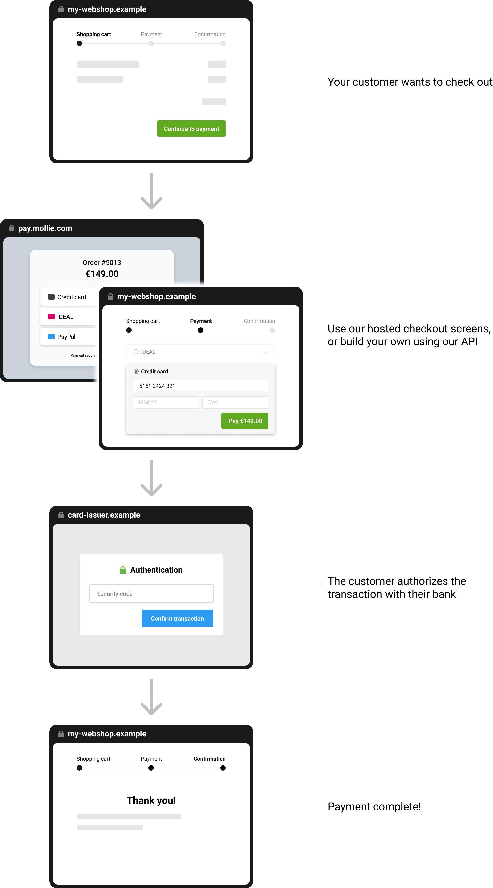

Accepting payments
==================
With Mollie, accepting payments is a breeze. We provide `integrations <https://www.mollie.com/integrations>`_ for all
common e-commerce platforms, such as Shopify, WooCommerce, and Magento. Simply installing the Mollie module from the
platform's module store is enough to start receiving payments.

Do you want to build an integration yourself instead? Grab the
`Mollie API client <https://www.mollie.com/developers/packages>`_ for your language of choice and continue reading.

The basic payment flow
----------------------
In its simplest form, setting up a payment requires only three steps: setting up the payment with our
:doc:`Payments API </reference/v2/payments-api/create-payment>`, sending the customer to our
:doc:`hosted checkout </payments/hosted-checkout>`, and processing the :doc:`webhook </overview/webhooks>` we send once
the payment is completed.

You can also opt for a deeper integration, from offering your own payment method selection all the way to embedding
credit card fields in your own checkout experience. Please refer to our guide on
:doc:`building your own checkout </payments/build-your-own-checkout>` to dive into how the Mollie checkout flow can be
fully integrated.

Either way, from your customer's perspective, the journey looks roughly as follows. Depending on the payment method,
additional information may have to be filled out by your customer, and they may get sent to their bank or card issuer to
authenticate the transaction.

Working with the Payments API
-----------------------------
To make the basic payment flow explained above a bit more concrete, here is the same flow, step by step, from a
programmer's perspective.

.. image:: images/api-overview-flow@2x.png

#. A customer on your website decides to checkout.

#. Your website :doc:`creates a payment </reference/v2/payments-api/create-payment>` on the Mollie platform by calling
   the Payments API with the amount and description, and with a URL we should redirect the customer to after the payment
   is made.

   The API responds with the unique ID and the unique checkout URL for the newly created payment. Your website stores
   the ``id``, links it to the customer's order and redirects the customer to the checkout URL (present in
   ``_links.checkout``).

   .. note:: You should use HTTP ``GET`` for the redirect to the ``_links.checkout`` URL. Using HTTP ``POST`` for
      redirection will cause issues with some payment methods or iDEAL issuers. Use HTTP status code ``303 See
      Other`` to force an HTTP ``GET`` redirect.

#. The customer reaches the :doc:`checkout </payments/hosted-checkout>`, chooses a payment method and makes the payment.
   This process is entirely taken care of by Mollie. You do not have to do anything here.

#. When the payment is made, Mollie will send you a :doc:`webhook </overview/webhooks>` informing your website about the
   :doc:`payment's status change </payments/status-changes>`. You can configure the webhook URL per profile in your
   Mollie account, or per payment in the API request.

   In response to your webhook being called your application just needs to issue a ``200 OK`` status. From that response
   Mollie can tell that your processing of the new status was successful – for any other response we keep trying.

#. When your website processes the webhook, it
   :doc:`fetches the payment status </reference/v2/payments-api/get-payment>` from the Mollie API. Once the status is
   `paid`, your website can send out a confirmation email to the customer and start the order fulfilment.

#. At this point Mollie returns the visitor to your website using the redirect URL specified when the payment was
   created. Your website usually already knows the payment was successful, and thanks the customer.

Tracking your order reference
-----------------------------
In the example above we assume you will store the unique payment ``id`` in your database. This way your website is able
to lookup the order for this payment when the webhook is triggered by Mollie. Storing it yourself is the easiest way to
keep a link between the Mollie payment reference and your website's order reference.

Alternatively, we can store your order reference — or any other 'meta data' — for you. Simply pass along the data with
the payment using the ``metadata`` field in the Payments API and we will store it with the payment. Everytime you
retrieve the payment from the Mollie API, we will show the ``metadata`` field as well.
