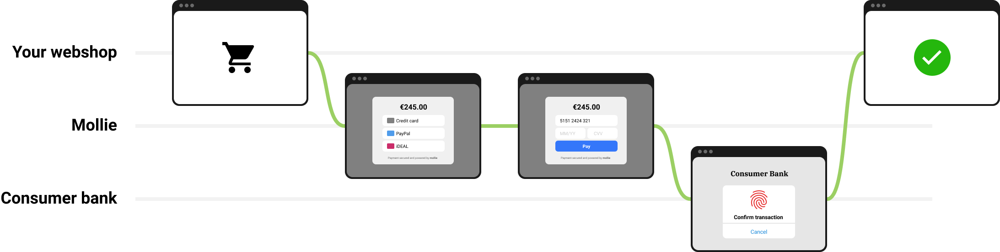
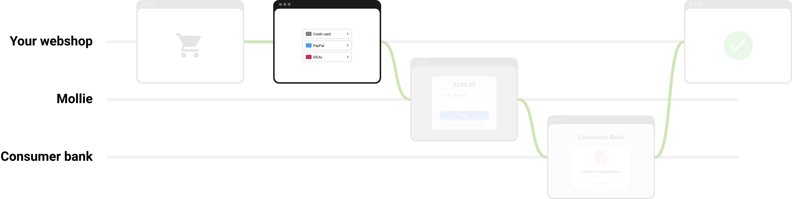
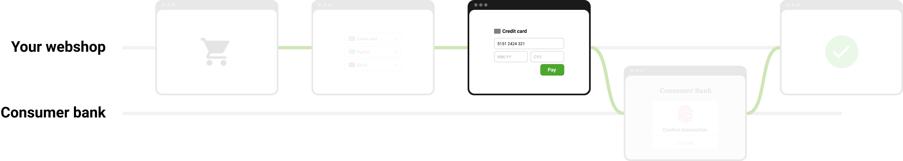
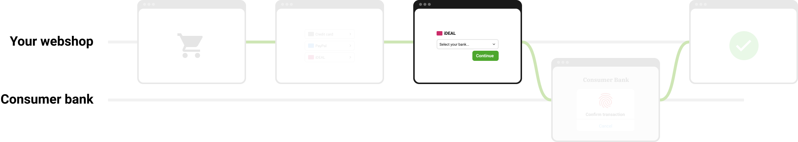

Build your own checkout
=======================
Mollie provides a :doc:`hosted checkout system </payments/hosted-checkout>` out of the box. Your Mollie integration can
be as simple as creating a payment request, sending your customer to our checkout, and letting us handle the rest.

The guide on :doc:`accepting payments </payments/accepting-payments>` is a good starting point for this basic payment
flow.

If you are using an e-commerce platform, chances are we also provide a `module <https://www.mollie.com/integrations>`_
for it that offers a deeper checkout experience than this hosted checkout flow.

If, however, you are keen on building your own checkout experience, then read on.

The common checkout path
------------------------
The most common checkout path can be broken down into a handful of steps.

The steps are roughly as follows:

#. Your customer wants to check out.

#. After setting up a payment using the :doc:`Create payment endpoint </reference/v2/payments-api/create-payment>`, you
   send your customer to our payment method selection screen.

#. Depending on the payment method, your customer may need to provide additional information.

#. Depending on the payment method, the customer may need to authenticate the transaction with their bank or card
   issuer.

#. The customer completes the payment, you receive a :doc:`webhook </overview/webhooks>`, and the customer is sent back
   to your website.

Embedding method selection
--------------------------
A good first step towards a deeper checkout integration is to provide your own payment method selection.

To accomplish this, first use the :doc:`Methods API </reference/v2/methods-api/list-methods>` to retrieve the payment
methods currently active on your account.

Once your customer has selected a payment method, use that selection to fill out the ``method`` field in the
:doc:`Create payment endpoint </reference/v2/payments-api/create-payment>`.

Deeper payment method integrations
----------------------------------
The next steps for a deeper integration depend on which payment methods you are looking to offer. The below list gives
an overview of the typical flow for each of our payment methods, and how they can be integrated further.

.. list-table::
   :widths: 15, 50, 35
   :header-rows: 1

   * - Method
     - Customer-facing flow
     - Deeper integration

   * - **Apple Pay**
     - #. Customer selects Apple Pay at checkout using the dedicated Apple Pay button.
       #. Customer verifies their payment with their Apple device's native authentication.
       #. Customer returns to the webshop.
     - The Apple Pay button (step 1) can be integrated using the
       :doc:`Wallets API </reference/v2/wallets-api/request-apple-pay-payment-session>`.

   * - **Bancontact**
     - #. Customer selects Bancontact at checkout.
       #. Customer gets redirected to Bancontact to verify their payment with their bank credentials or to complete via
          QR.
       #. Customer returns to the webshop.
     - No deeper integration possible.

   * - **Bank transfer**
     - #. Customer selects Bank transfer at checkout.
       #. Customer gets redirected to Mollie, where the bank transfer details are shown.
       #. Customer returns to the webshop.
       #. Customer completes the payment manually via their bank.
     - The bank transfer details (step 2) are returned by the
       :doc:`Payments API </reference/v2/payments-api/get-payment>` when setting up the
       payment. They can be integrated directly, skipping the need for a redirect.

   * - **Credit card**
     - #. Customer selects credit card at checkout.
       #. Customer enters their credit card details.
       #. Customer may get redirected to their card issuer to verify their payment with 3-D Secure.
       #. Customer returns to the webshop.
     - The credit card detail screen (step 2) can be integrated using Mollie Components. See
       :ref:`embedding-credit-card-fields` below.

   * - **EPS**
     - #. Customer selects EPS at checkout.
       #. Customer gets redirected to EPS to select their bank.
       #. Customer gets redirected to their bank to verify their payment with their bank credentials.
       #. Customer returns to the webshop.
     - No deeper integration possible.

   * - **giropay**
     - #. Customer selects EPS at checkout.
       #. Customer gets redirected to giropay to verify their payment with their bank credentials.
       #. Customer returns to the webshop.
     - No deeper integration possible.

   * - **iDEAL**
     - #. Customer selects iDEAL at checkout.
       #. Customer gets redirected to Mollie to select their bank or to complete via QR.
       #. Customer gets redirected to their bank to verify their payment with their bank credentials.
       #. Customer returns to the webshop.
     - The issuer selection screen (step 2) can be integrated using the Methods API. See
       :ref:`embedding-issuer-selection` below. The QR flow (step 2) can also be
       integrated using the QR embed in the Payments API. See the :doc:`QR codes guide </payments/qr-codes>` for
       details.

   * - **KBC/CBC**
     - #. Customer selects KBC/CBC at checkout.
       #. Customer gets redirected to Mollie to select their bank.
       #. Customer gets redirected to their bank to verify their payment with their bank credentials.
       #. Customer returns to the webshop.
     - The issuer selection screen (step 2) can be integrated using the Methods API. See
       :ref:`embedding-issuer-selection` below.

   * - **Klarna: Pay later**
     - #. Customer selects Pay later at checkout.
       #. Customer gets redirected to Klarna to verify their payment with their Klarna account, or by supplying
          additional information.
       #. Customer returns to the webshop.
     - No deeper integration possible.

   * - **Klarna: Slice it**
     - #. Customer selects Slice it at checkout.
       #. Customer gets redirected to Klarna to verify their payment instalment plan with their Klarna account, or by
          supplying additional information.
       #. Customer returns to the webshop.
     - No deeper integration possible.

   * - **PayPal**
     - #. Customer selects PayPal or PayPal Express Checkout at checkout.
       #. For non-express PayPal payments, customer gets redirected to PayPal to verify their payment with their PayPal
          account.
       #. Customer returns to the webshop.
     - When using the Orders API, you can integrate the PayPal Express Checkout button directly in your checkout for an
       even faster checkout process. See the :doc:`Orders guide </orders/overview>` for details.

   * - **paysafecard**
     - #. Customer selects paysafecard at checkout.
       #. Customer gets redirected to paysafecard to verify their payment with their prepaid card.
       #. Customer returns to the webshop.
     - No deeper integration possible.

   * - **Przelewy24**
     - #. Customer selects Przelewy24 at checkout.
       #. Customer gets redirected to Przelewy24 to select their bank.
       #. Customer gets redirected to their bank to verify their payment with their bank credentials.
       #. Customer returns to the webshop.
     - No deeper integration possible.

   * - **SOFORT**
     - #. Customer selects SOFORT at checkout.
       #. Customer gets redirected to SOFORT to select their bank.
       #. Customer verifies their payment with their bank credentials.
       #. Customer returns to the webshop.
     - No deeper integration possible.

.. _embedding-credit-card-fields:

Embedding credit card fields
^^^^^^^^^^^^^^^^^^^^^^^^^^^^

For the credit card payment method, you can fully embed the credit card input fields while staying PCI-DSS-compliant
using Mollie Components. Please refer to the guide on :doc:`Mollie Components </components/overview>` for more
information on how to integrate.

.. _embedding-issuer-selection:

Embedding issuer selection
^^^^^^^^^^^^^^^^^^^^^^^^^^

For iDEAL, KBC/CBC, and gift cards, we offer a way to embed the issuer selection into the checkout flow. You can
retrieve the available issuers for these payment methods using the ``issuers`` include in the
:doc:`Methods API </reference/v2/methods-api/list-methods>`.

Once your customer has selected an issuer, use that selection to fill out the ``issuer`` field in the
:doc:`Create payment endpoint </reference/v2/payments-api/create-payment>`.
