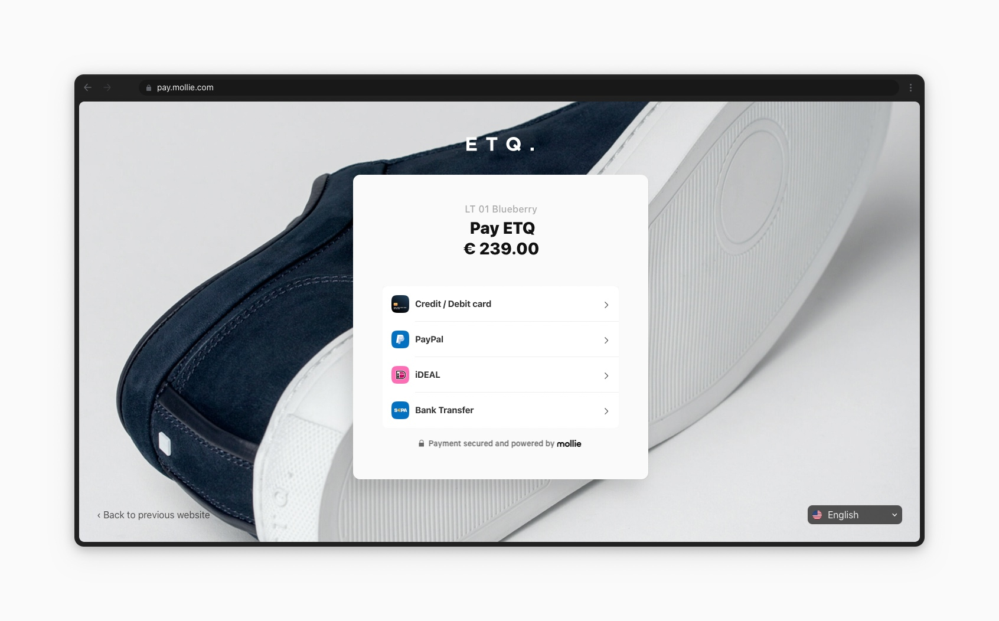

Hosted checkout
===============
Mollie provides a hosted checkout environment dubbed **Mollie Checkout**. These hosted payment pages allow your customer
to select their payment method of choice and to complete the payment.

Using Mollie Checkout is optional. We do recommend using it, since it is battle-tested and optimized for performance and
conversion. If, however, you would like to provide a custom checkout experience, please refer to our guide on
:doc:`building your own checkout </payments/build-your-own-checkout>`.

Our full hosted checkout experience can be viewed on `our Hosted Checkout demo <https://demo.mollie.com/>`_.

Please also refer to the `Mollie Checkout product page <https://www.mollie.com/products/checkout>`_ on our website.

   A fully customized hosted checkout from one of our merchants.

Benefits of Mollie Checkout
---------------------------
* Mollie's hosted payment pages have been optimized for devices of all common brands and sizes, including phones and
  tablets.

* All payment methods you have enabled are – when relevant – shown to your customers. A newly activated payment method
  is available immediately for all of your visitors.

* If the customer's first payment attempt is unsuccessful, for example because the customer has insufficient balance on
  their card, it is very easy for the customer to make another payment attempt with the same or even a different payment
  method. No need to implement any extra APIs.

* Full support for :doc:`QR codes </payments/qr-codes>`.

* Full support for wallet-style payments such as :doc:`Apple Pay </wallets/applepay>`.

* Mollie optimizes the order of payment methods. For example, for Dutch customers we know to list iDEAL at the top while
  for Belgians the payment method Bancontact is listed first. We optimize this per country using A/B-testing. This way
  we help improve your conversion.

Personalize your checkout
-------------------------
It is possible to customize the checkout by adding your own brand images. You can upload a logo and a wallpaper. The
image at the top of the page is a good example of a fully branded checkout page.

#. Go to your `Profiles <https://www.mollie.com/dashboard/settings/profiles>`_.
#. Click on a **Personalize Checkout** button.
#. Upload images within the specified restrictions.

The personalization of a background can also be viewed on `our Hosted Checkout demo <https://demo.mollie.com/>`_.

Single-click payments for returning customers
---------------------------------------------
Our hosted checkout offers your returning `credit card <https://www.mollie.com/payments/credit-card>`_ customers the
option to complete their payment with a card they previously used at your webshop.

To enable the functionality, simply use the :doc:`Customers API </reference/v2/customers-api/overview>` to create a
unique customer. When setting up the payment for this specific customer, use the customer ID from the Customers API in
the ``customerId`` field of the Payments API.

When setting up a subsequent payment for the same customer, the customer will automatically be shown any cards they
previously used on the same device.

Please note customer consent is required to support one-click payments.

.. figure:: images/mollie-checkout-example-b@2x.jpg

   An example of the credit card selection screen shown to a returning customer.
