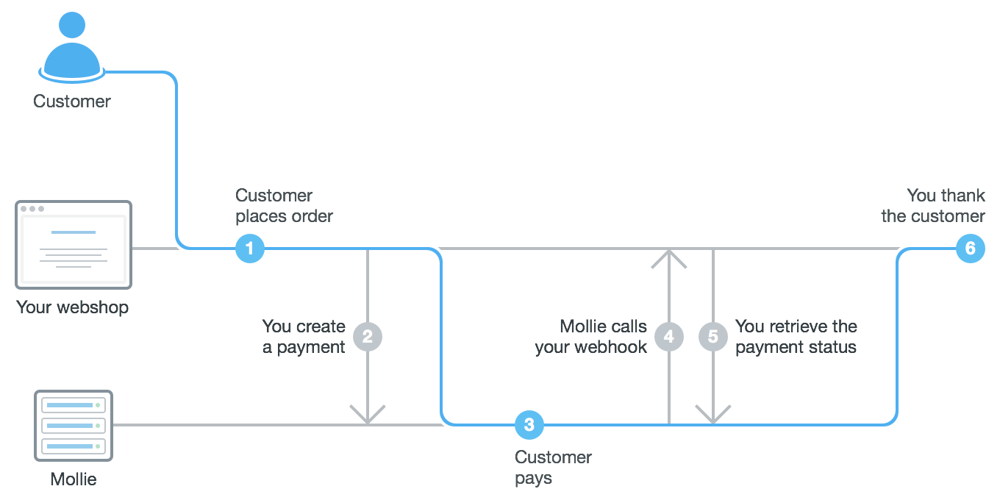

Payments API
============

The **Payments API** allows you to create payments for your web shop, e-invoicing platform or other application that you
need payments for.

How does the Payments API work?
-------------------------------

#. A customer on your website decides to checkout.

#. Your website :doc:`creates a payment </reference/v2/payments-api/create-payment>` on the Mollie platform by calling
   the Payments API with the amount, a payment description, a webhook URL, and a URL we should redirect the customer to
   after the payment is made.

   The API responds with the unique id and the ``_links.checkout`` URL for the newly created payment. Your website
   stores the ``id``, links it to the customer's order and redirects the customer to the URL in the ``_links.checkout``
   property from the Mollie API response. This is the URL to the hosted payment page for this specific payment.

   .. note:: You should use HTTP ``GET`` for the redirect to the ``_links.checkout`` URL. Using HTTP ``POST`` for
      redirection will cause issues with some payment methods or iDEAL issuers. Use HTTP status code ``303 See
      Other`` to force an HTTP ``GET`` redirect.

#. The customer reaches the :doc:`checkout </guides/checkout>`, chooses a payment method and makes the payment. This
   process is entirely taken care of by Mollie. You don't need to do anything here.

#. When the payment is made Mollie will call your :doc:`webhook </guides/webhooks>` informing your website about the
   :doc:`payment's status change </payments/status-changes>`. You should define a webhook when creating the
   payment.

   In response to your webhook being called your application just needs to issue a ``200 OK`` status. From that response
   Mollie can tell that your processing of the new status was successful – for any other response we keep trying.

#. Processing the webhook request your website
   :doc:`fetches the payment status </reference/v2/payments-api/get-payment>` using the Mollie API. This fetched status
   serves to mark the payment paid, trigger fulfilment and send out an email confirmation to the customer.

#. At this point Mollie returns the visitor to your website using the ``redirectUrl`` specified when the payment was
   created. Your website already knows the payment was successful and thanks the customer.

Using metadata
--------------
In the example above we suppose you will store the ``id`` that's unique to the payment in your order table. This way
your website is able to look-up the order for this payment when the webhook is triggered by Mollie. Your website is
keeping track of the payment, effectively bringing about the connection between order and payment. This approach is
easiest to grasp, which is why we use it in our example.

Alternatively you could ask Mollie to remember the unique identifier of your order by instructing the Mollie API to
store it in the payment's ``metadata``. You would provide it while creating the payment. In our example ``order_id``
would be a good candidate. Mollie stores the metadata for you, when you fetch the payment during processing the webhook
the metadata is included in the response. This is another way to connect orders and payments. We advise to use the
``metadata`` approach. This is the most popular approach and it's easiest to implement.
