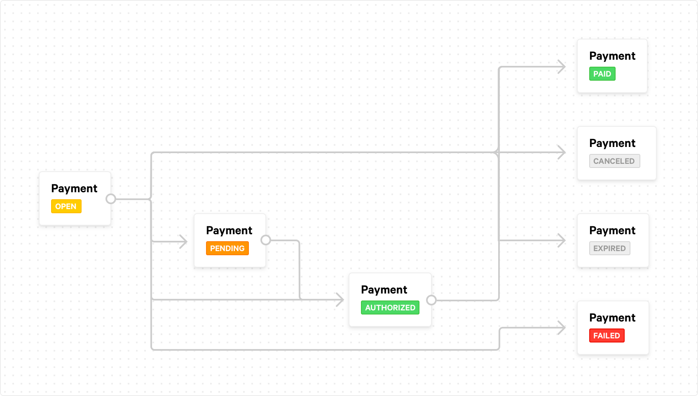

Payment status changes
======================

Every possible payment status
-----------------------------
Depending on what happens payments go through a number of statuses. On this page we will first simply list and explain
them. Then we will show you how the statuses are connected.

``open``
    The payment has been created, but nothing else has happened yet. This is not a status Mollie will call your
    :doc:`webhook </guides/webhooks>` for.

``canceled``
    Your customer has canceled the payment. This is a definitive status. Mollie will call your webhook when this status
    is reached.

    .. note:: In the ``v1`` API, this status was misspelled as ``cancelled``. This has been rectified in later versions.

``pending``
    This is a temporary status that can occur when the actual payment process has been started, but it's not complete
    yet. Nothing really needs to happen on your end when this status occurs. Mollie will not call your webhook when this
    status occurs.

``authorized``
    If the payment method supports captures, the payment method will have this status for as long as new captures can be
    created.

    Currently this status is only possible for the payment methods
    `Klarna Pay later <https://www.mollie.com/payments/klarna-pay-later>`_ and
    `Klarna Slice it <https://www.mollie.com/payments/klarna-slice-it>`_.

``expired``
    The payment has expired, e.g. your customer has abandoned the payment.

    For some payment methods like ``banktransfer`` it can take a few days for this status to
    occur. This status is definitive and we will call your webhook when it occurs. How much time it takes for a payment
    to expire depends on the payment method. We explain this in more detail below.

``failed``
    The payment has failed and cannot be completed with a different payment method. We will call your webhook when a
    payment transitions to the ``failed`` status.

``paid``
    This status occurs whenever a payment is successfully paid. When this status occurs we will call your webhook.

.. note:: In the ``v1`` API, there were statuses for when payments were refunded, charged back, or paid out (settled).
          These statuses have been removed in ``v2``. You can get the same information from other properties on the
          :doc:`Payment object </reference/v2/payments-api/get-payment>`.

How does one status lead to another?
------------------------------------
Please look at the below diagram. It tells you exactly when to expect what status:

.. note:: The payment status for SEPA Direct Debit payments could also change from ``pending`` to ``failed``.

When does a payment expire?
---------------------------
When your customer doesn't make an actual payment, the payment will at some point expire. After a certain expiry time an
``open`` payment will become ``expired``. This could happen when a customer decides not to make a payment after all, and
abandons it. The expiry time is different for each payment method:

Expiry times per payment method
-------------------------------

+---------------------------------+-----------------------------------+
| Payment methods                 | Expiry time                       |
+=================================+===================================+
| - iDEAL                         | 15 minutes                        |
| - paysafecard                   |                                   |
+---------------------------------+-----------------------------------+
| - Credit card                   | 30 minutes                        |
+---------------------------------+-----------------------------------+
| - Bancontact                    | 1 hour                            |
| - Belfius Pay Button            |                                   |
| - EPS                           |                                   |
| - Giropay                       |                                   |
| - KBC                           |                                   |
| - MyBank                        |                                   |
| - Przelewy24                    |                                   |
+---------------------------------+-----------------------------------+
| - SOFORT Banking                | 2 hours                           |
+---------------------------------+-----------------------------------+
| - PayPal                        | 3 hours                           |
| - Vouchers                      |                                   |
+---------------------------------+-----------------------------------+
| - Klarna Pay Later. / Slice It. | 48 hours                          |
+---------------------------------+-----------------------------------+
| - ING Home'Pay                  | Next business day at 09:00 AM     |
+---------------------------------+-----------------------------------+
| - Bank transfer [#f1]_          | 12(+2) days                       |
+---------------------------------+-----------------------------------+

.. note:: It is not a good idea to predict payment expiry. Best wait until your webhook is called and fetch the status
          as usual. This is the most reliable way to keep your system in sync with Mollie, also in the case of expiring
          payments.

.. rubric:: Footnotes

.. [#f1] Payments made by bank transfer are done manually by your customer. Some days can pass before it becomes clear
         the payment has been paid. That's why the payment method ``banktransfer`` will by default not expire until 12
         days have passed. One or two days can be added when the 12\ :sup:`th` day is a Saturday or Sunday.
